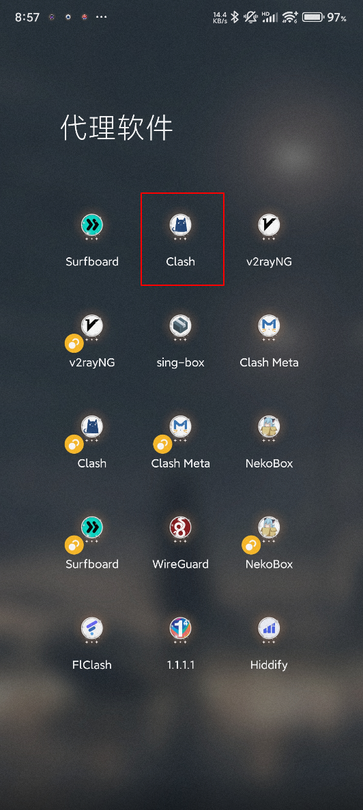
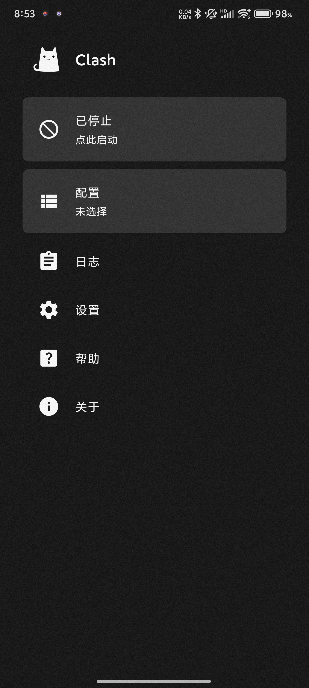
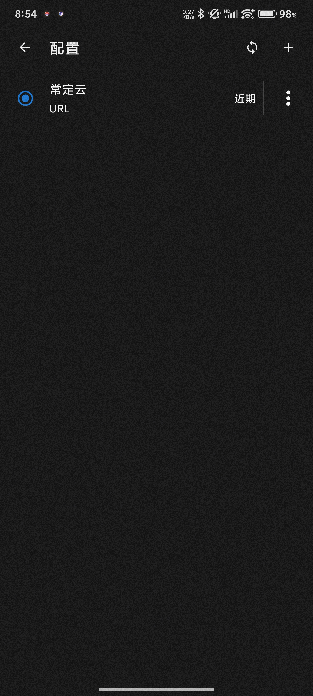
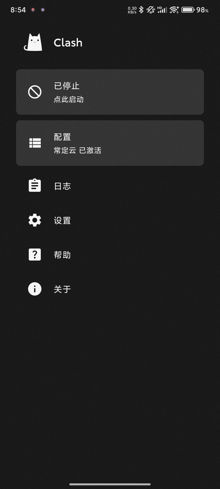

# Clash for Android 使用教程：订阅链接导入、节点测速与系统代理设置

适用平台：Android

适用关键词：Clash for Android 教程、Clash Android 订阅链接、安卓 Clash 配置教程。

本教程用于帮助用户把服务商提供的订阅链接导入 Clash for Android，完成节点测速，并选择可用节点。请在当地法律法规和服务条款允许的范围内使用网络代理工具。

## 教程导航

- [返回首页](../../README.md)
- [查看软件下载地址](../../docs/proxy-client-downloads.md)
- [订阅无效排查](../../docs/troubleshooting/invalid-subscription.md)

## 软件截图

### 软件图标

下图是 Clash for Android 的软件图标，用于确认没有打开到其他同名或仿冒客户端。

### 主界面预览

下图是 Clash for Android 的主界面或初始界面，后续步骤会从这里开始操作。

## 操作步骤

### 1. 进入配置页

打开 Clash for Android 后，点击首页的“配置/未选择”入口，准备导入订阅配置。

### 2. 添加配置

进入配置列表后点击右上角的加号，新建一个配置来源。

### 3. 选择 URL 导入

在导入方式里选择“URL/从 URL 导入”，用于添加机场或代理服务提供的订阅链接。

### 4. 填写订阅链接

在 URL 输入框粘贴订阅链接；名称可以填写服务商或套餐备注，方便以后区分。填写后点击右上角保存。

### 5. 选中配置

保存后回到配置列表，点选刚刚导入的配置，让圆点变为选中状态。

### 6. 启动代理

返回首页，确认配置已激活，然后点击“已停止/点此启动”开启代理服务。

### 7. 测试节点延迟

进入“代理/规则模式”，点击右上角闪电按钮测试延迟，优先选择有延迟数值的节点。

## 使用建议

- 不建议长期使用“自动选择”节点，频繁跳 IP 可能影响账号登录环境。
- 如果订阅无法更新，先回官网重新复制最新订阅链接。

## 截图对应关系

本页截图按原始教程引用顺序整理，文件编号如下：

`1.png`, `2.png`, `2.png`, `3.png`, `4.png`, `5.png`, `6.png`, `7.png`, `8.png`

