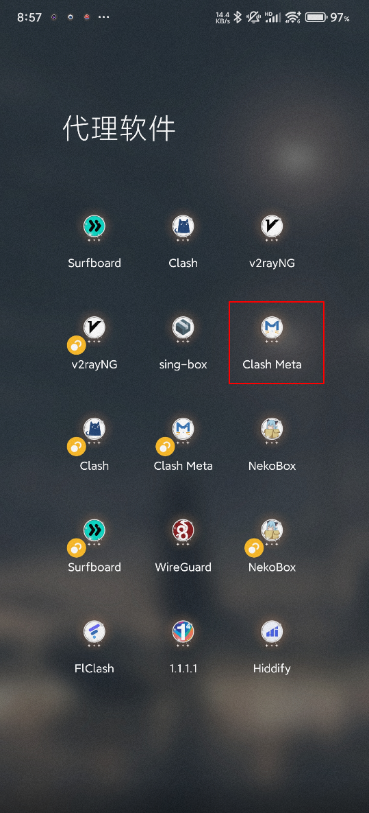
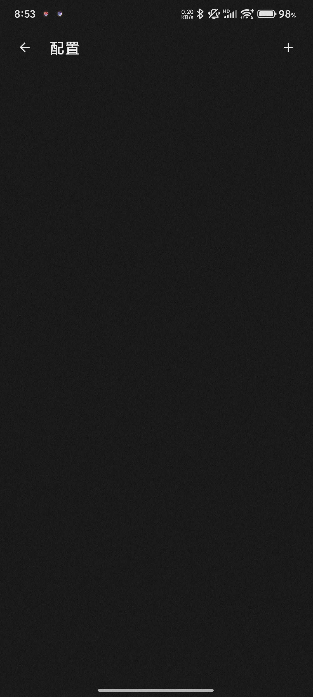
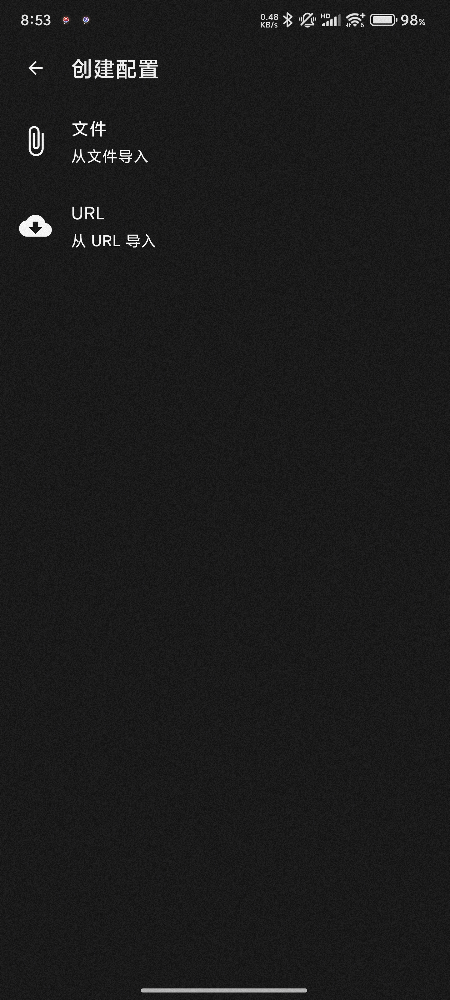
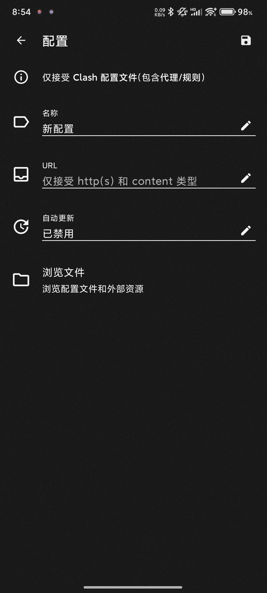
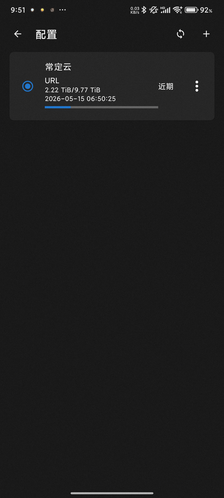
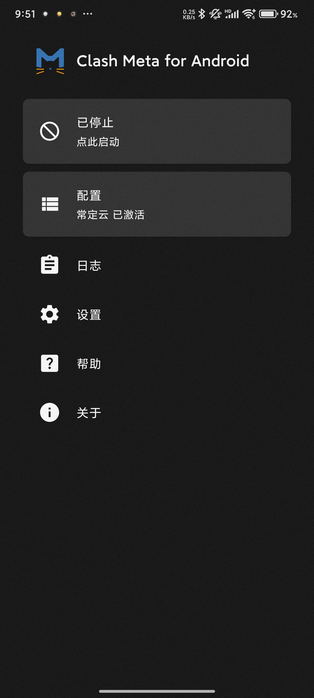
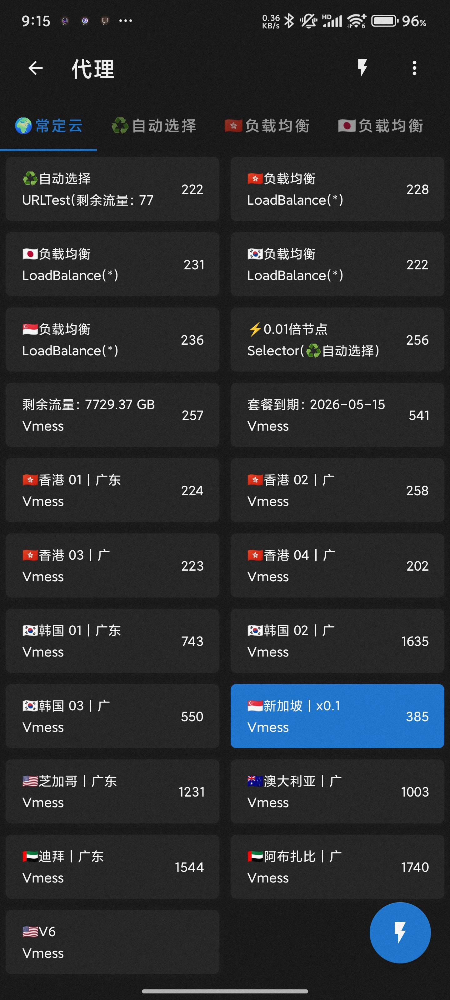

# Clash Meta for Android 使用教程：订阅链接导入、节点测速与系统代理设置

适用平台：Android

适用关键词：Clash Meta for Android 教程、Clash Meta 安卓配置、Clash Meta 订阅链接。

本教程用于帮助用户把服务商提供的订阅链接导入 Clash Meta for Android，完成节点测速，并选择可用节点。请在当地法律法规和服务条款允许的范围内使用网络代理工具。

## 教程导航

- [返回首页](../../README.md)
- [查看软件下载地址](../../docs/proxy-client-downloads.md)
- [订阅无效排查](../../docs/troubleshooting/invalid-subscription.md)

## 软件截图

### 软件图标

下图是 Clash Meta for Android 的软件图标，用于确认没有打开到其他同名或仿冒客户端。

### 主界面预览

下图是 Clash Meta for Android 的主界面或初始界面，后续步骤会从这里开始操作。

## 操作步骤

### 1. 进入配置模块

在首页点击“配置/未选择”，进入配置管理页面。

### 2. 点击加号

点击右上角加号，准备添加新的远程订阅配置。

### 3. 选择 URL 导入

在导入方式中选择“URL/从 URL 导入”。

### 4. 粘贴订阅

将机场官网复制的订阅链接粘贴到 URL 栏，名称填写易识别的备注，然后保存。

### 5. 选中订阅

在配置列表中选中新导入的订阅，使其成为当前活动配置。

### 6. 启动连接

回到首页，确认配置已激活后点击启动按钮。

### 7. 测速选节点

进入代理页，点击闪电图标测试延迟，选择有延迟反馈的节点使用。

## 使用建议

- Clash Meta 与 Clash for Android 的导入流程相近，但图标和界面略有不同。

## 截图对应关系

本页截图按原始教程引用顺序整理，文件编号如下：

`9.png`, `10.png`, `10.png`, `3.png`, `4.png`, `5.png`, `11.png`, `12.png`, `8.png`

