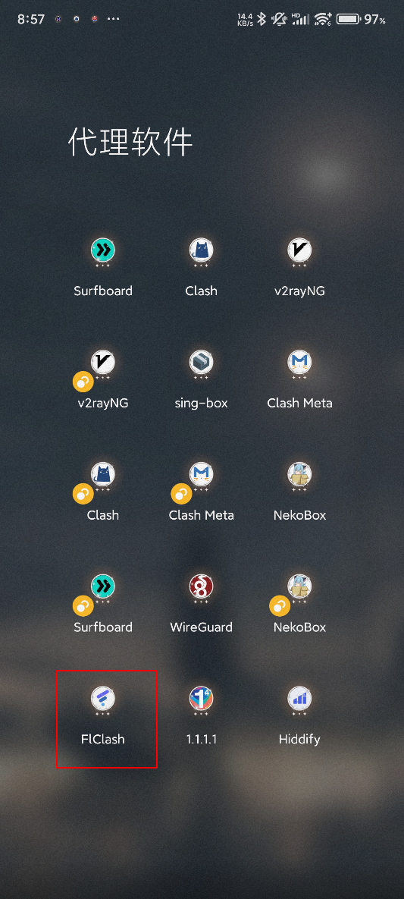
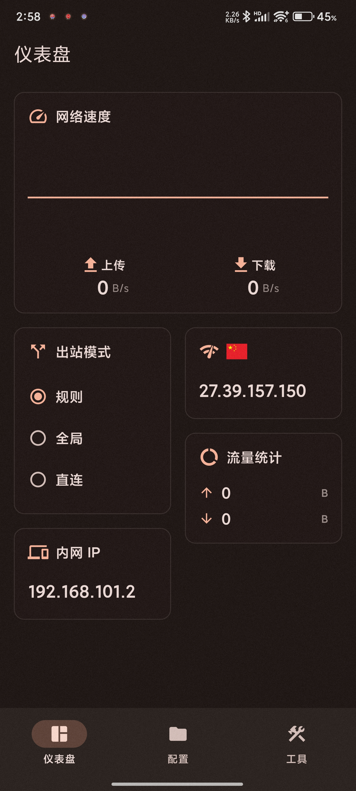
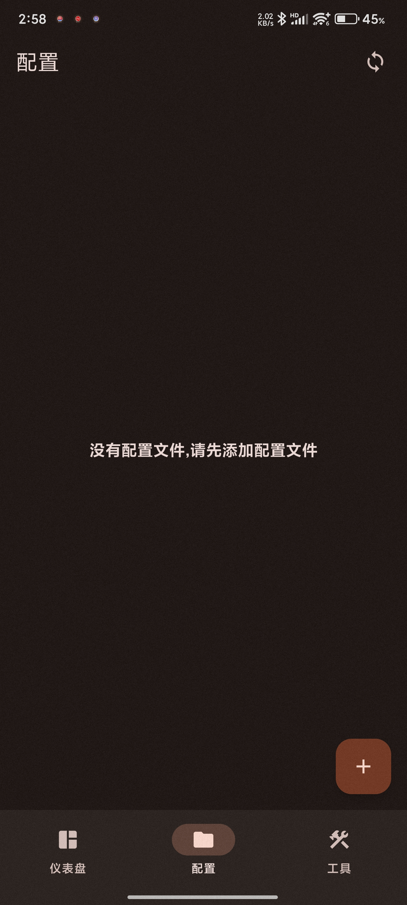
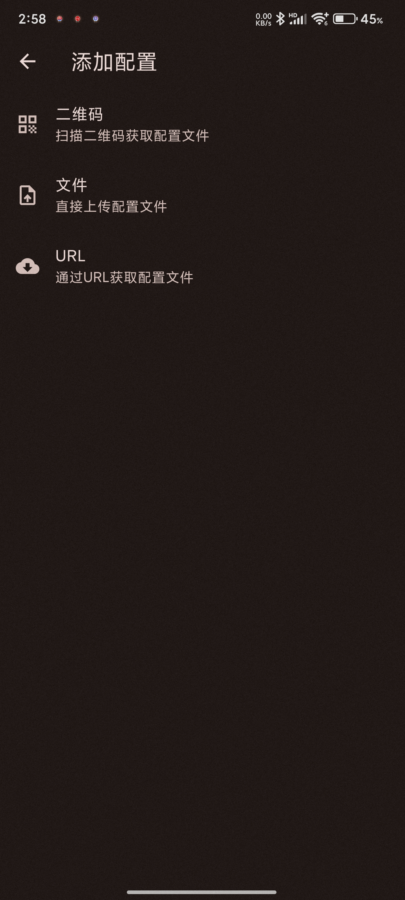
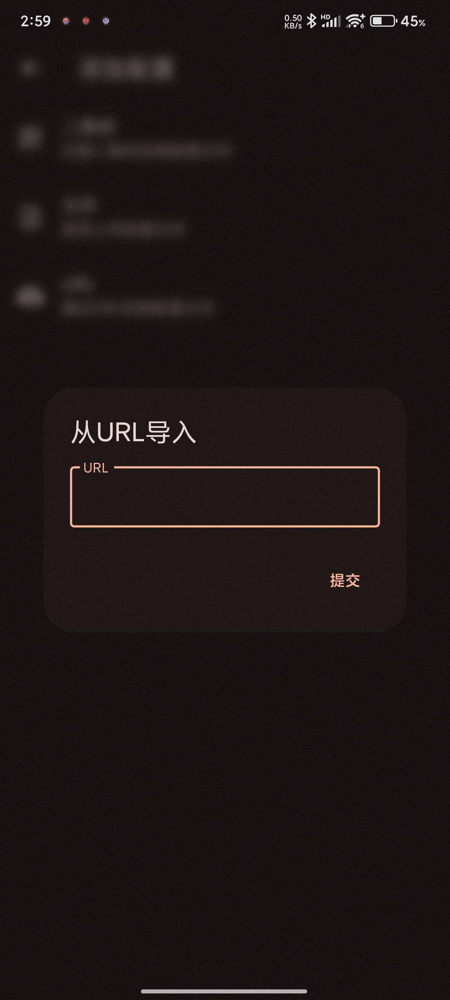
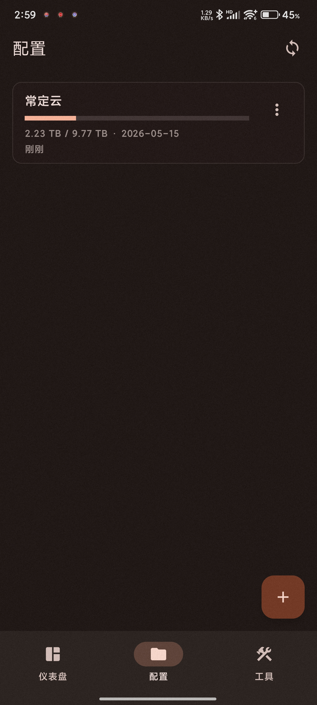
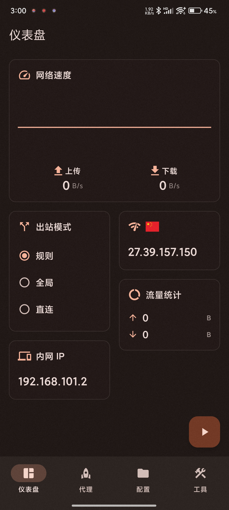
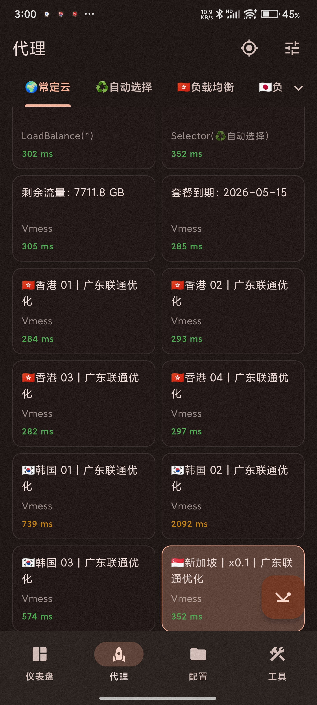

# FlClash for Android 使用教程：订阅链接导入、节点测速与系统代理设置

适用平台：Android

适用关键词：FlClash Android 教程、FlClash 订阅导入、安卓 FlClash 配置。

本教程用于帮助用户把服务商提供的订阅链接导入 FlClash for Android，完成节点测速，并选择可用节点。请在当地法律法规和服务条款允许的范围内使用网络代理工具。

## 教程导航

- [返回首页](../../README.md)
- [查看软件下载地址](../../docs/proxy-client-downloads.md)
- [订阅无效排查](../../docs/troubleshooting/invalid-subscription.md)

## 软件截图

### 软件图标

下图是 FlClash for Android 的软件图标，用于确认没有打开到其他同名或仿冒客户端。

### 主界面预览

下图是 FlClash for Android 的主界面或初始界面，后续步骤会从这里开始操作。

## 操作步骤

### 1. 进入配置

点击配置选项，再点击加号添加订阅。

### 2. 选择 URL

在添加配置中选择“URL/通过 URL 获取配置文件”。

### 3. 提交订阅链接

将官网复制的订阅链接粘贴到 URL 输入框，然后点击提交。

### 4. 确认下载成功

看到配置已经出现在列表中，说明订阅已保存到手机。

### 5. 开启连接

返回仪表盘，点击右下角按钮开启代理。

### 6. 测速选节点

进入代理页，点击右下角测速按钮，选择有延迟的节点使用。

## 使用建议

- FlClash 的 Android 和 Windows 操作逻辑接近，但按钮位置会随屏幕尺寸变化。

## 截图对应关系

本页截图按原始教程引用顺序整理，文件编号如下：

`52.png`, `53.png`, `54.png`, `55.png`, `56.png`, `57.png`, `58.png`, `59.png`

