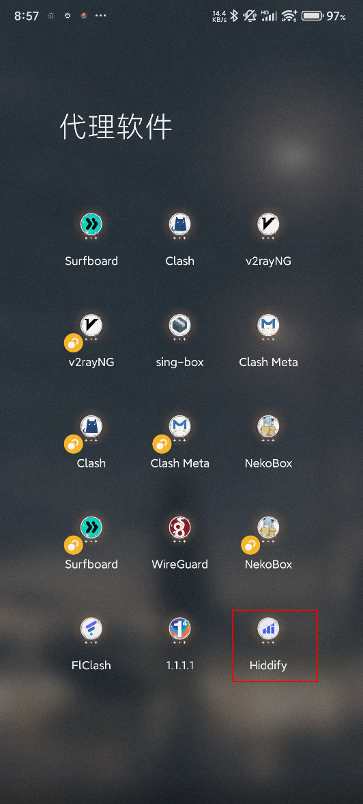
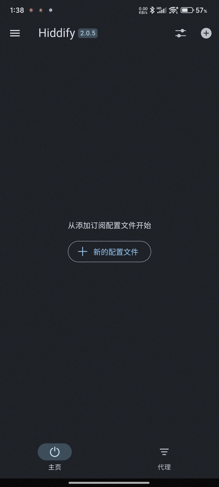
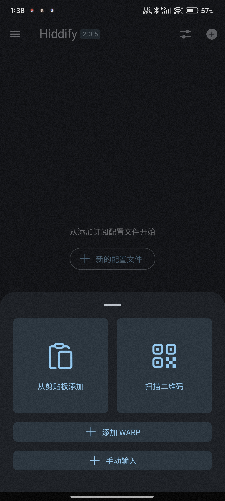
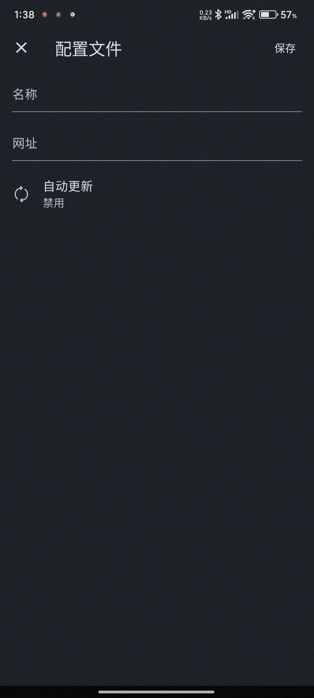
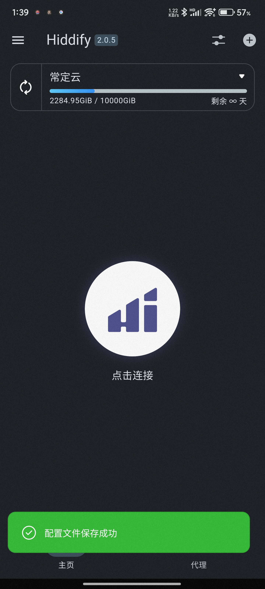
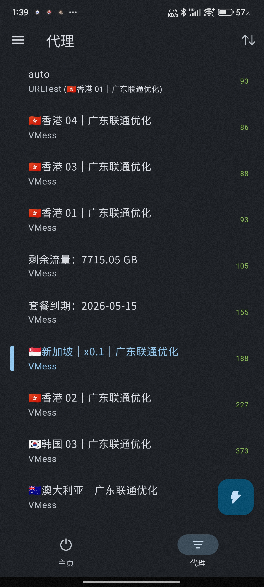

# Hiddify for Android 使用教程：订阅链接导入、节点测速与系统代理设置

适用平台：Android

适用关键词：Hiddify Android 教程、Hiddify 订阅链接、安卓 Hiddify 配置。

本教程用于帮助用户把服务商提供的订阅链接导入 Hiddify for Android，完成节点测速，并选择可用节点。请在当地法律法规和服务条款允许的范围内使用网络代理工具。

## 教程导航

- [返回首页](../../README.md)
- [查看软件下载地址](../../docs/proxy-client-downloads.md)
- [订阅无效排查](../../docs/troubleshooting/invalid-subscription.md)

## 软件截图

### 软件图标

下图是 Hiddify for Android 的软件图标，用于确认没有打开到其他同名或仿冒客户端。

### 主界面预览

下图是 Hiddify for Android 的主界面或初始界面，后续步骤会从这里开始操作。

## 操作步骤

### 1. 添加配置文件

在首页点击添加新的配置文件，选择手动输入。

### 2. 填写订阅地址

名称填写备注，网址粘贴订阅链接，点击右上角保存。

### 3. 确认保存成功

看到配置文件保存成功提示后，点击连接。

### 4. 选择节点

Hiddify 会自动测试延迟，选择有延迟反馈的节点使用。

## 使用建议

- 首次导入后等待几秒，让客户端完成配置解析和延迟测试。

## 截图对应关系

本页截图按原始教程引用顺序整理，文件编号如下：

`36.png`, `37.png`, `38.png`, `39.png`, `40.png`, `41.png`

