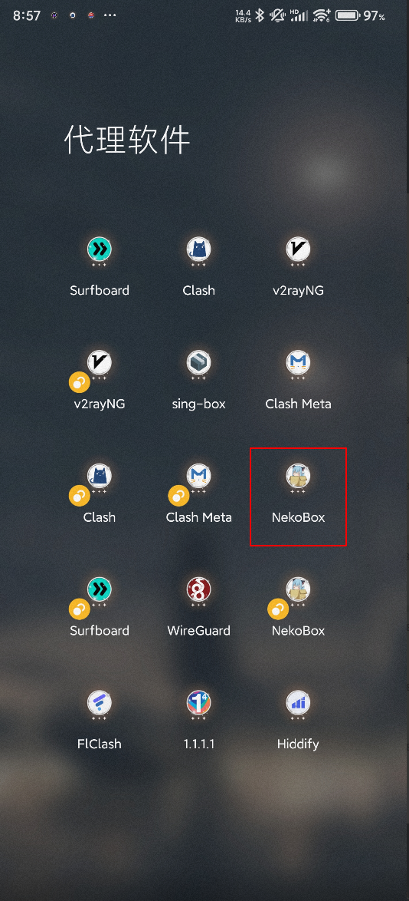
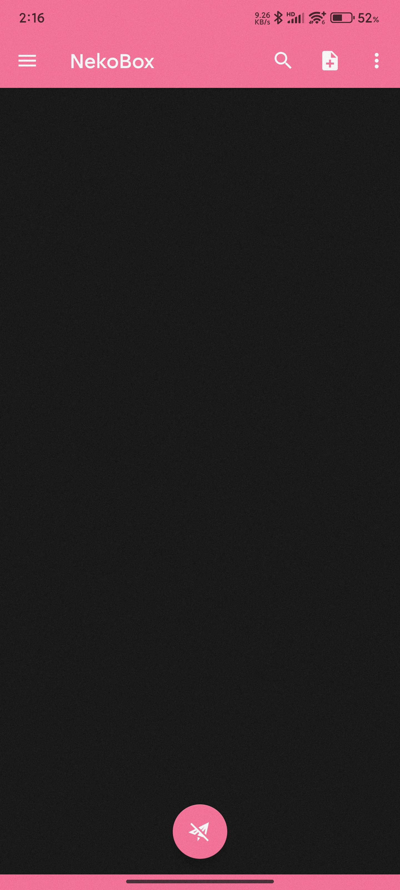
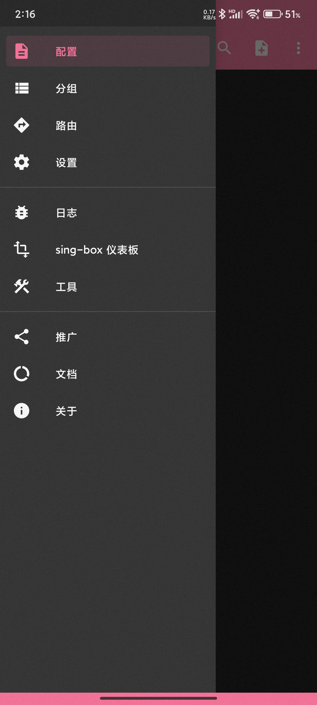
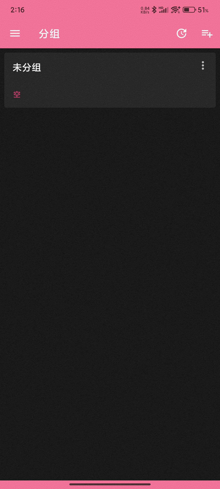
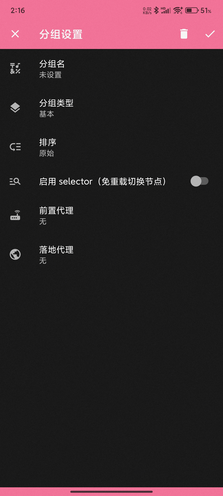
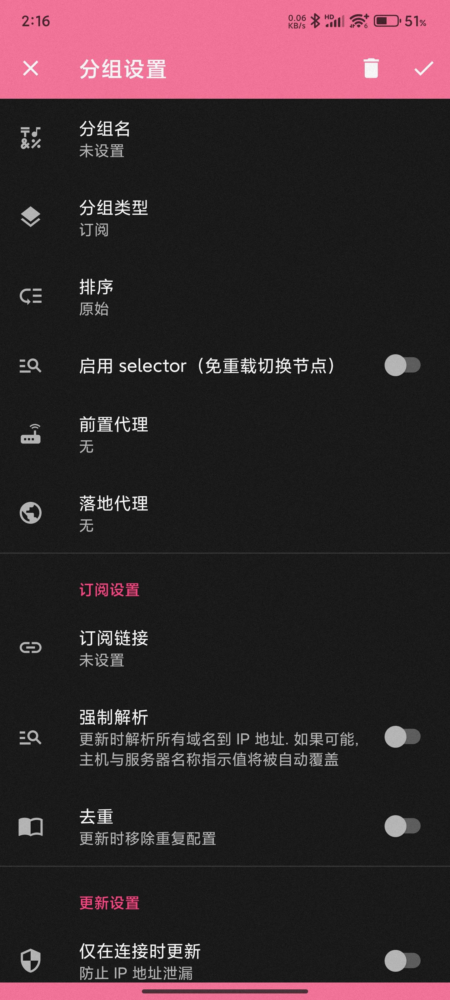
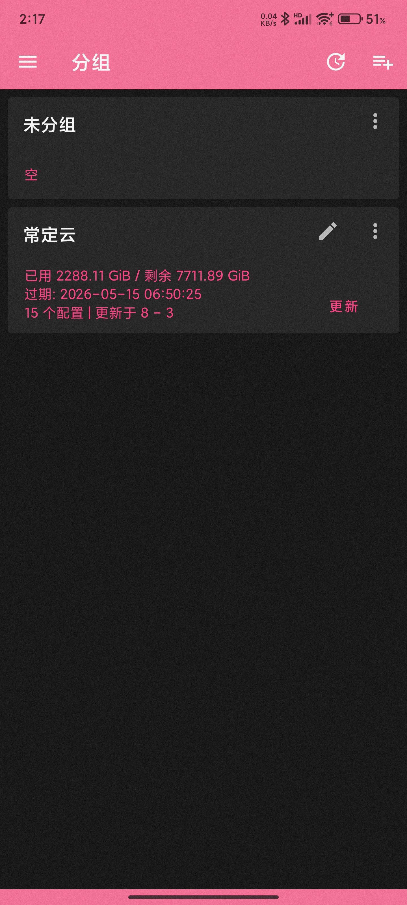
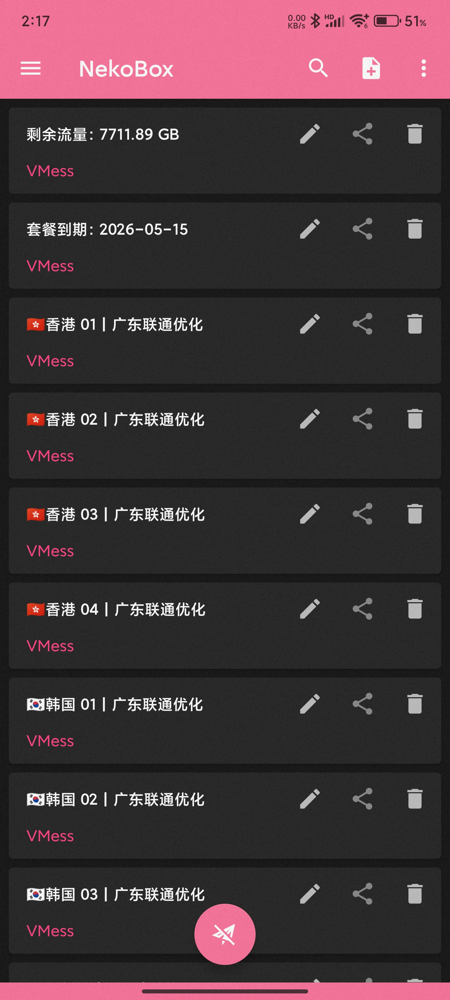
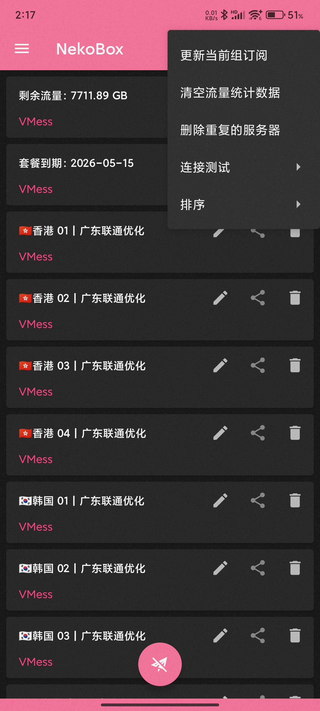
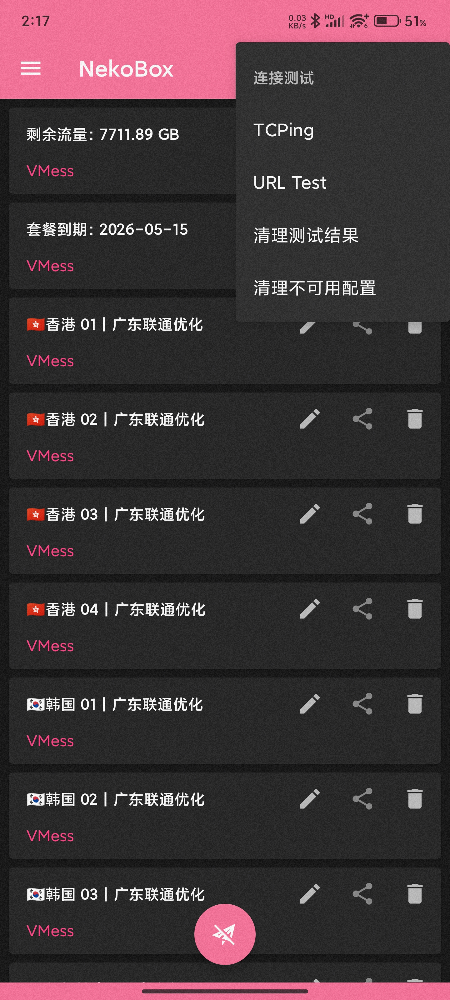

# NekoBox for Android 使用教程：订阅链接导入、节点测速与系统代理设置

适用平台：Android

适用关键词：NekoBox Android 教程、NekoBox 订阅设置、安卓 NekoBox 配置。

本教程用于帮助用户把服务商提供的订阅链接导入 NekoBox for Android，完成节点测速，并选择可用节点。请在当地法律法规和服务条款允许的范围内使用网络代理工具。

## 教程导航

- [返回首页](../../README.md)
- [查看软件下载地址](../../docs/proxy-client-downloads.md)
- [订阅无效排查](../../docs/troubleshooting/invalid-subscription.md)

## 软件截图

### 软件图标

下图是 NekoBox for Android 的软件图标，用于确认没有打开到其他同名或仿冒客户端。

### 主界面预览

下图是 NekoBox for Android 的主界面或初始界面，后续步骤会从这里开始操作。

## 操作步骤

### 1. 打开侧边栏

点击左上角三条横线，进入侧边菜单。

### 2. 进入分组

在菜单里选择“分组”。

### 3. 新增分组

进入分组页面后点击右上角添加按钮。

### 4. 查看分组编辑页

进入新建分组界面，准备填写订阅信息。

### 5. 配置订阅分组

将分组类型改为订阅，分组名填写备注，在订阅链接处粘贴官网复制的链接，点击右上角勾号保存。

### 6. 更新订阅

返回上一级页面，点击更新，等待节点列表下载完成。

### 7. 回到节点列表

回到首页后可以看到节点已出现，此时还需要测试真连接。

### 8. 打开更多菜单

点击右上角三个点。

### 9. 选择连接测试

在菜单中选择连接测试。

### 10. 执行 URL Test

选择 URL Test，等待测速完成后使用有延迟的节点。

## 使用建议

- NekoBox 分组逻辑比较明显，订阅链接应放在“订阅设置”区域，不要填到普通备注栏。

## 截图对应关系

本页截图按原始教程引用顺序整理，文件编号如下：

`42.png`, `43.png`, `43.png`, `44.png`, `45.png`, `46.png`, `47.png`, `48.png`, `49.png`, `49.png`, `50.png`, `51.png`

