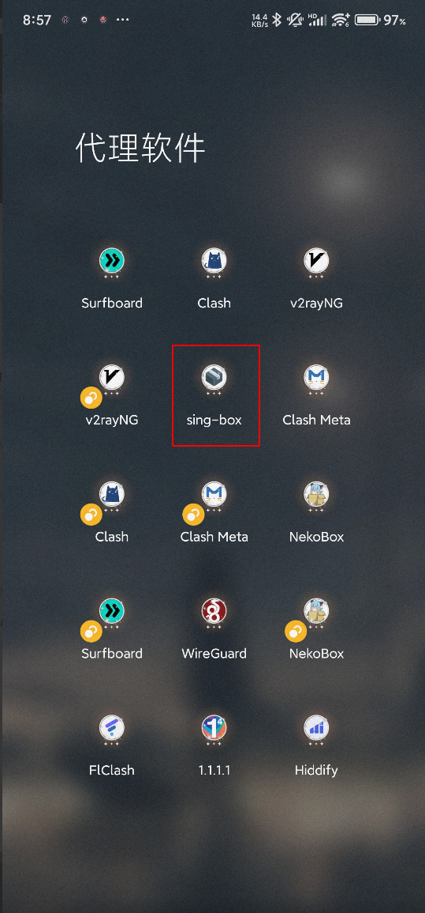
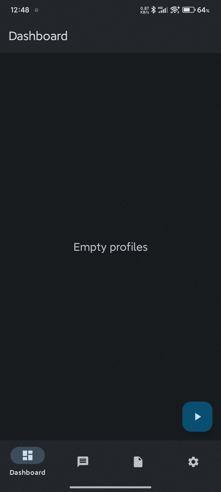
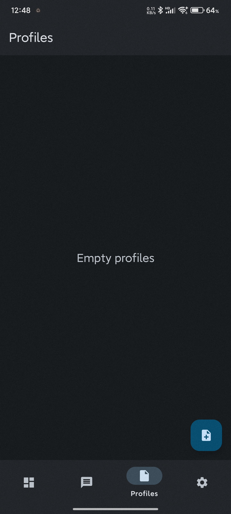
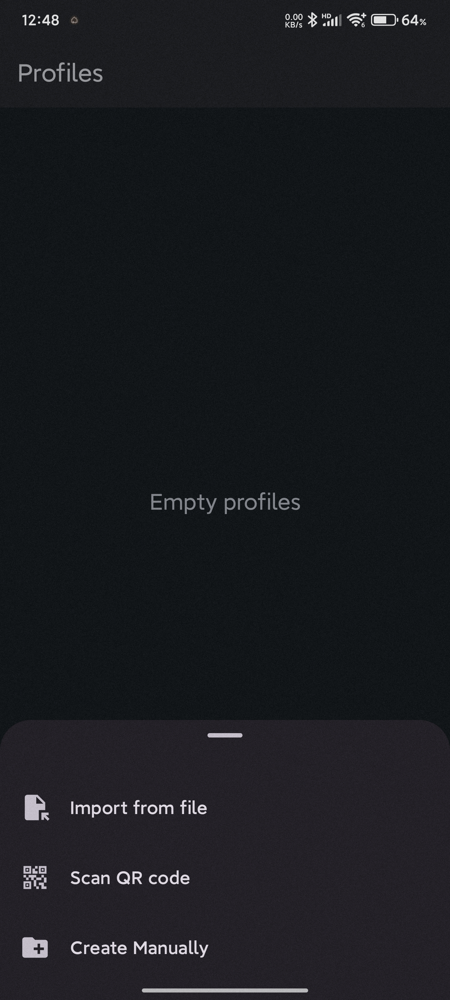
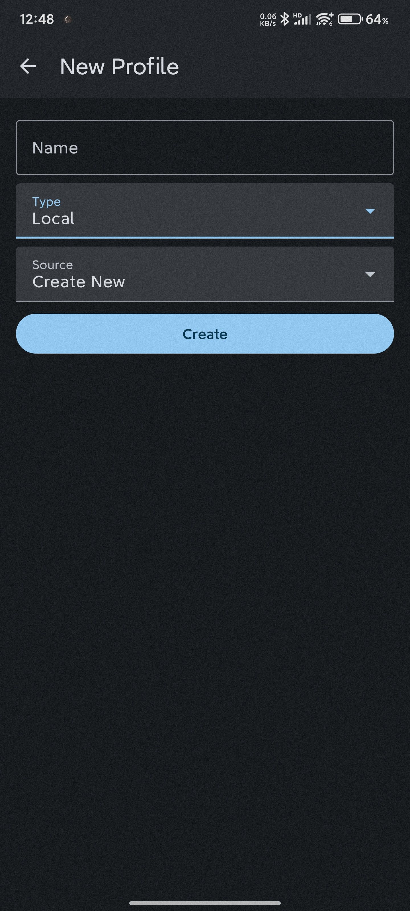
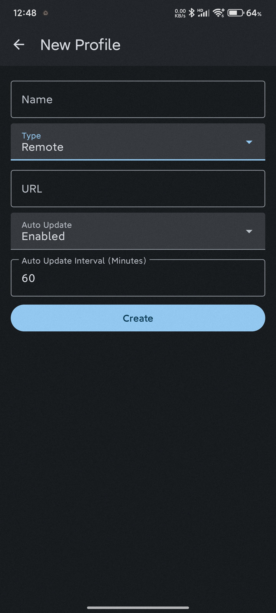
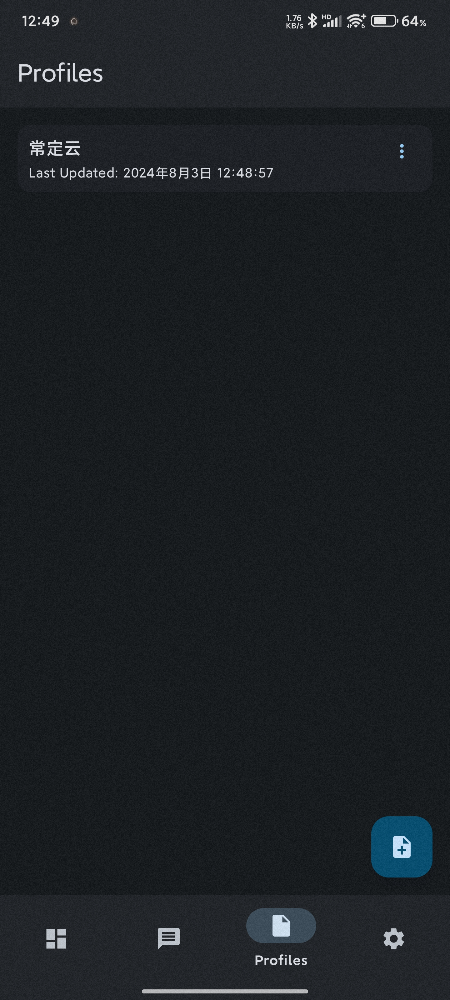
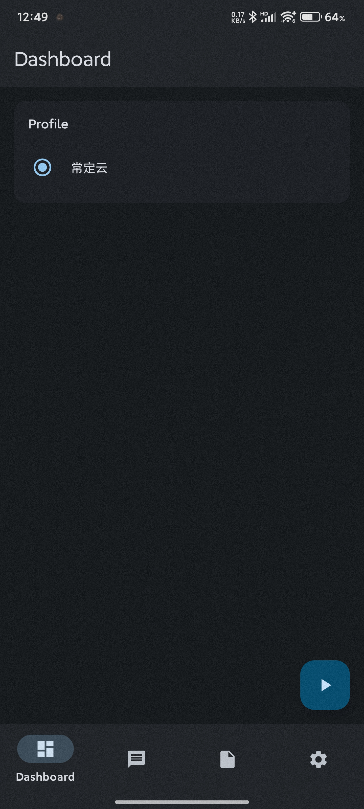
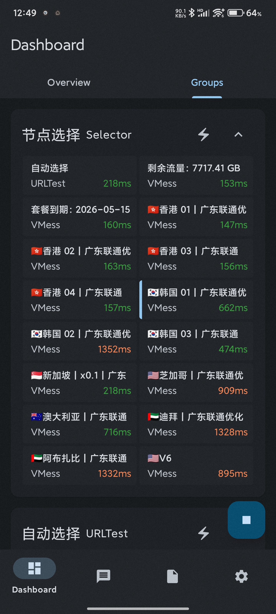

# sing-box 使用教程：订阅链接导入、节点测速与系统代理设置

适用平台：Android

适用关键词：sing-box 教程、sing-box Android 配置、sing-box 订阅链接。

本教程用于帮助用户把服务商提供的订阅链接导入 sing-box，完成节点测速，并选择可用节点。请在当地法律法规和服务条款允许的范围内使用网络代理工具。

## 教程导航

- [返回首页](../../README.md)
- [查看软件下载地址](../../docs/proxy-client-downloads.md)
- [订阅无效排查](../../docs/troubleshooting/invalid-subscription.md)

## 软件截图

### 软件图标

下图是 sing-box 的软件图标，用于确认没有打开到其他同名或仿冒客户端。

### 主界面预览

下图是 sing-box 的主界面或初始界面，后续步骤会从这里开始操作。

## 操作步骤

### 1. 打开 Profiles

进入 Profiles 配置页，点击右下角添加按钮。

### 2. 选择手动创建

在导入方式中选择 Create Manually。

### 3. 进入编辑页

进入配置编辑页面后，准备填写远程订阅信息。

### 4. 切换 Remote

将 Type 改为 Remote，在 URL 粘贴订阅链接，Name 填写便于识别的名称。

### 5. 确认配置下载

保存后确认订阅配置已经出现在列表中。

### 6. 开启订阅

点击右下角按钮启用当前配置。

### 7. 测试并选择节点

进入 Groups，点击闪电按钮测试延迟，选择有延迟的节点。

## 使用建议

- sing-box 对订阅格式更敏感，遇到导入失败时优先确认服务商是否支持 sing-box 格式。

## 截图对应关系

本页截图按原始教程引用顺序整理，文件编号如下：

`27.png`, `28.png`, `29.png`, `30.png`, `31.png`, `32.png`, `33.png`, `34.png`, `35.png`

