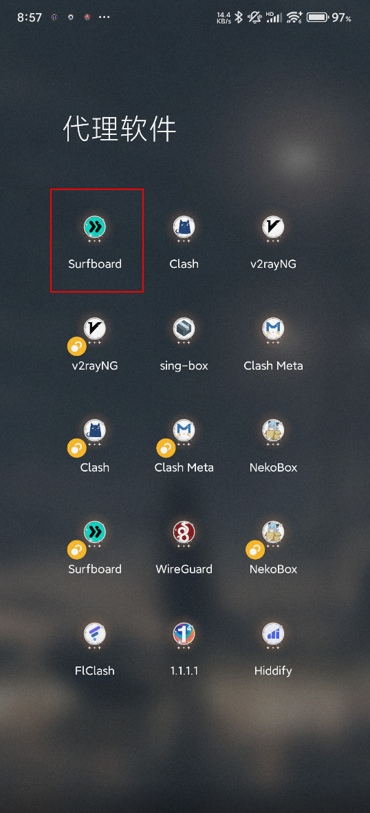
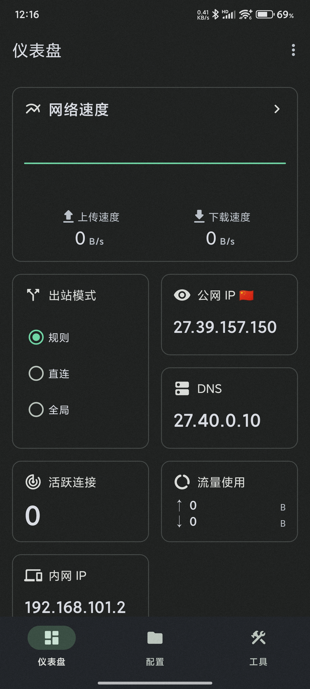
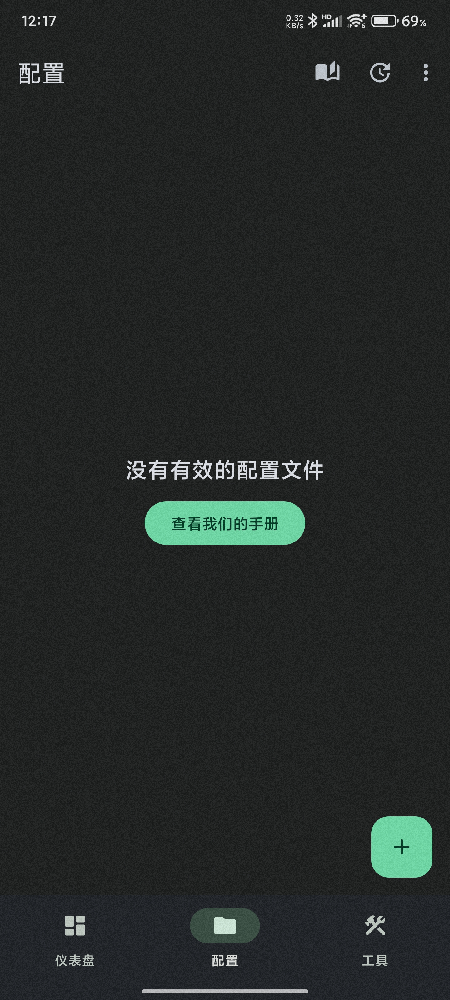
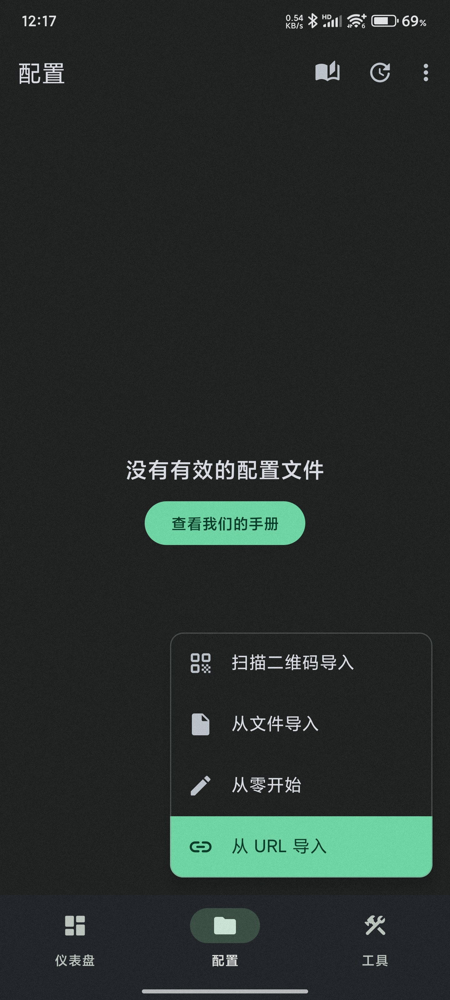
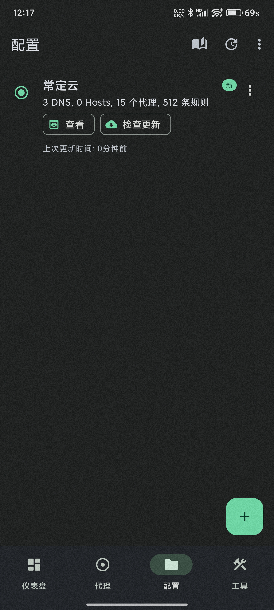
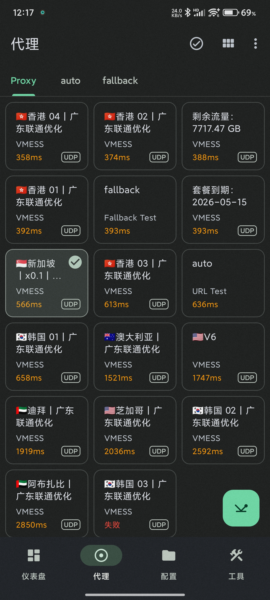

# Surfboard 使用教程：订阅链接导入、节点测速与系统代理设置

适用平台：Android

适用关键词：Surfboard 教程、Surfboard 订阅导入、安卓 Surfboard 代理设置。

本教程用于帮助用户把服务商提供的订阅链接导入 Surfboard，完成节点测速，并选择可用节点。请在当地法律法规和服务条款允许的范围内使用网络代理工具。

## 教程导航

- [返回首页](../../README.md)
- [查看软件下载地址](../../docs/proxy-client-downloads.md)
- [订阅无效排查](../../docs/troubleshooting/invalid-subscription.md)

## 软件截图

### 软件图标

下图是 Surfboard 的软件图标，用于确认没有打开到其他同名或仿冒客户端。

### 主界面预览

下图是 Surfboard 的主界面或初始界面，后续步骤会从这里开始操作。

## 操作步骤

### 1. 进入配置

在底部或首页进入配置页面，点击右下角加号。

### 2. 选择从 URL 导入

在弹出的导入方式中选择“从 URL 导入”，粘贴订阅链接并保存，等待配置下载完成。

### 3. 确认导入结果

看到配置已出现在列表中，说明订阅已经成功添加。

### 4. 启动并测速

返回仪表盘开启连接，再测试节点延迟，选择可用节点使用。

## 使用建议

- Surfboard 更适合偏规则分流的使用场景，导入前确认订阅格式兼容。

## 截图对应关系

本页截图按原始教程引用顺序整理，文件编号如下：

`21.png`, `22.png`, `23.png`, `24.png`, `25.png`, `26.png`

