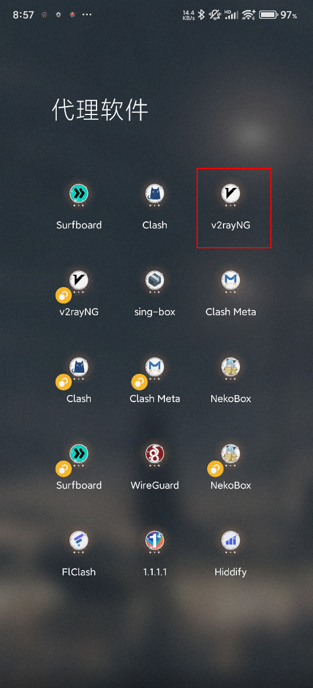
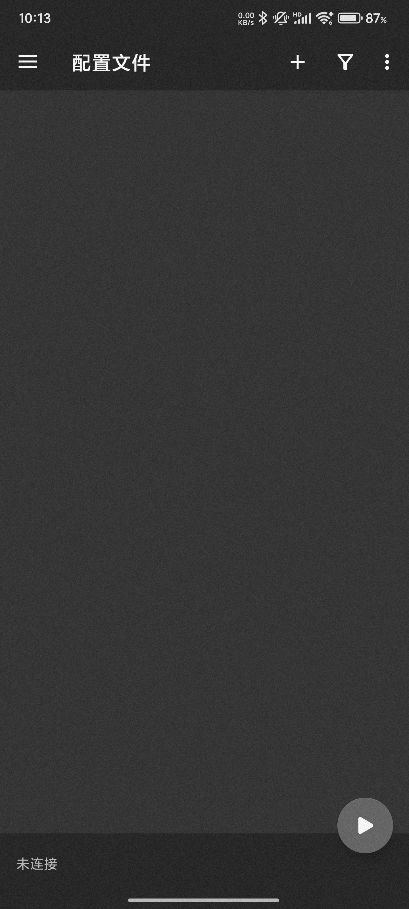
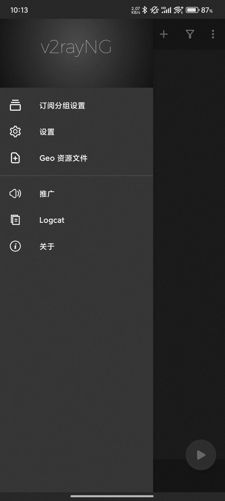
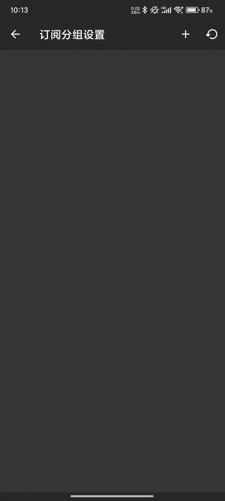
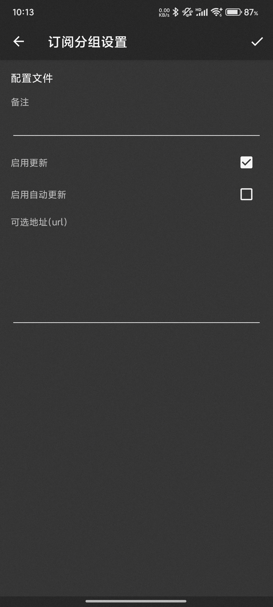
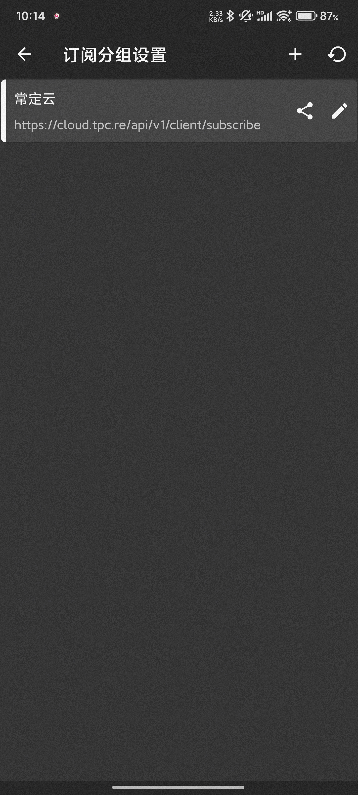
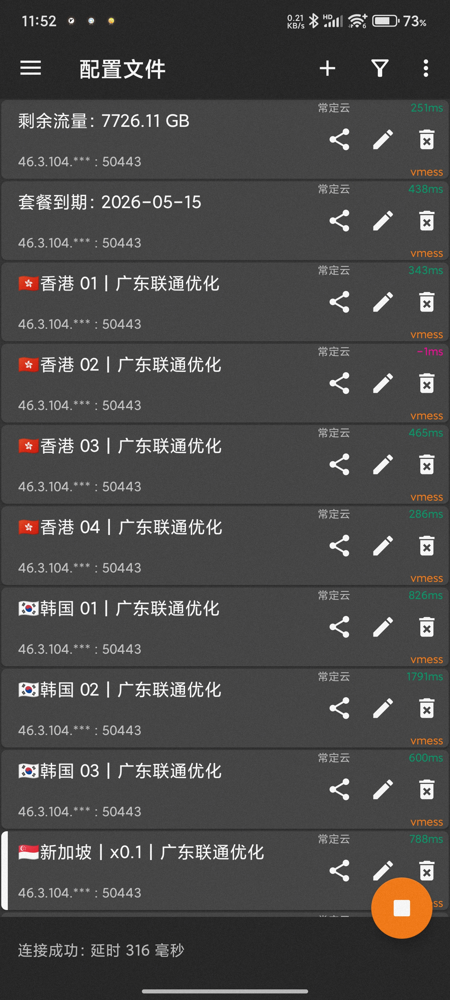
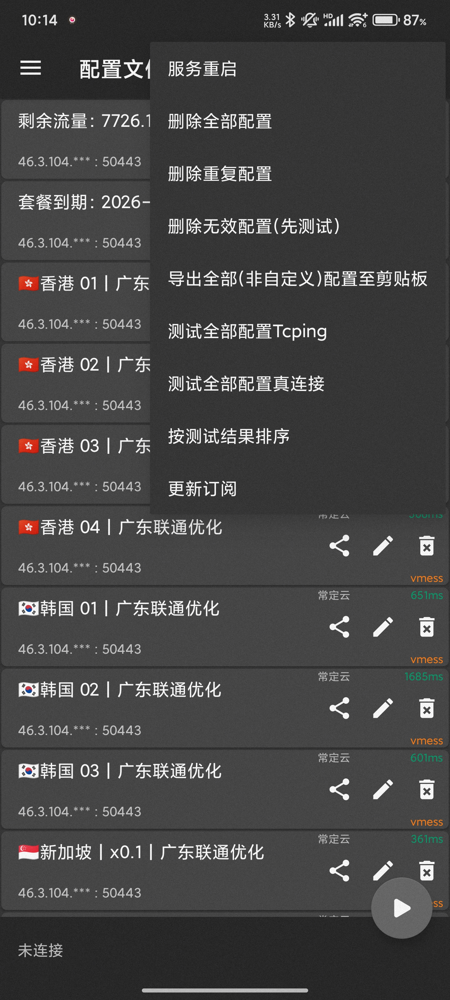

# V2rayNG 使用教程：订阅链接导入、节点测速与系统代理设置

适用平台：Android

适用关键词：V2rayNG 教程、V2rayNG 订阅设置、安卓 V2rayNG 配置。

本教程用于帮助用户把服务商提供的订阅链接导入 V2rayNG，完成节点测速，并选择可用节点。请在当地法律法规和服务条款允许的范围内使用网络代理工具。

## 教程导航

- [返回首页](../../README.md)
- [查看软件下载地址](../../docs/proxy-client-downloads.md)
- [订阅无效排查](../../docs/troubleshooting/invalid-subscription.md)

## 软件截图

### 软件图标

下图是 V2rayNG 的软件图标，用于确认没有打开到其他同名或仿冒客户端。

### 主界面预览

下图是 V2rayNG 的主界面或初始界面，后续步骤会从这里开始操作。

## 操作步骤

### 1. 打开订阅分组

在主界面进入订阅分组设置。

### 2. 新增分组

点击右上角加号，新建一个订阅分组。

### 3. 填写地址

在“可选地址/url”粘贴订阅链接，备注填写服务名或套餐名，点击勾号保存。

### 4. 更新订阅

返回上一级页面，点击右上角刷新按钮，将远程订阅下载到手机。

### 5. 打开菜单

回到节点列表，点击右上角三个点打开更多操作。

### 6. 测试真连接

选择“测试全部配置真链接”，等待测速完成；测试后优先选择有延迟数值的节点，再开启连接。

## 使用建议

- 如果订阅地址无法直接更新，可先确认手机网络是否能访问服务商官网。

## 截图对应关系

本页截图按原始教程引用顺序整理，文件编号如下：

`13.png`, `14.png`, `15.png`, `16.png`, `17.png`, `18.png`, `20.png`, `19.png`

