# Clash for Windows 使用教程：订阅链接导入、节点测速与系统代理设置

适用平台：Windows

适用关键词：Clash for Windows 教程、CFW 订阅链接、Windows Clash 配置。

本教程用于帮助用户把服务商提供的订阅链接导入 Clash for Windows，完成节点测速，并选择可用节点。请在当地法律法规和服务条款允许的范围内使用网络代理工具。

## 教程导航

- [返回首页](../../README.md)
- [查看软件下载地址](../../docs/proxy-client-downloads.md)
- [订阅无效排查](../../docs/troubleshooting/invalid-subscription.md)

## 软件截图

### 软件图标

下图是 Clash for Windows 的软件图标，用于确认没有打开到其他同名或仿冒客户端。

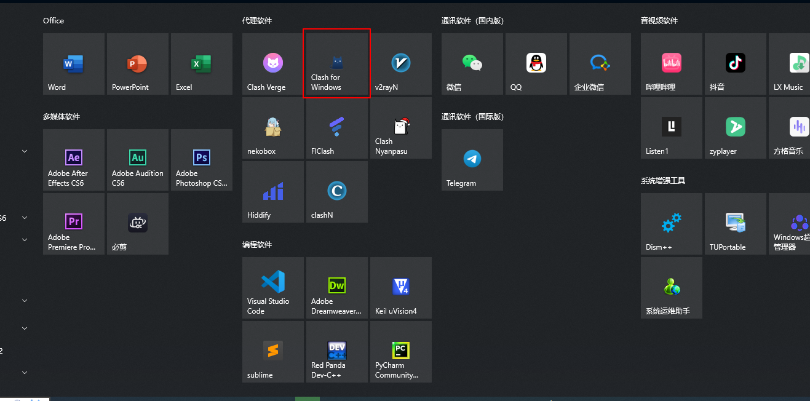

### 主界面预览

下图是 Clash for Windows 的主界面或初始界面，后续步骤会从这里开始操作。

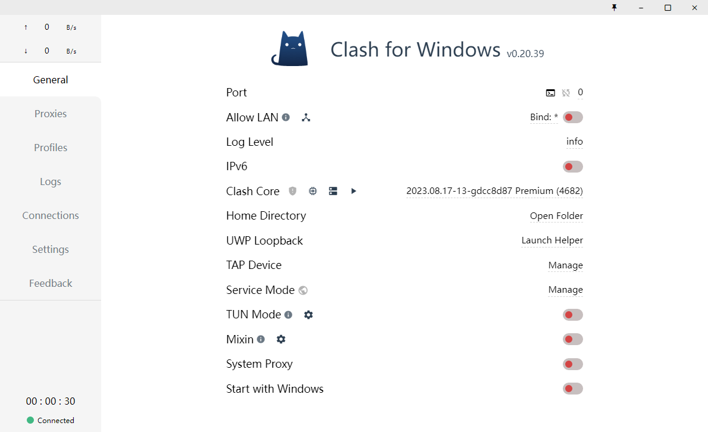

## 操作步骤

### 1. 开启 Clash Core

在 General 页面开启 Clash Core，让开关变为绿色。

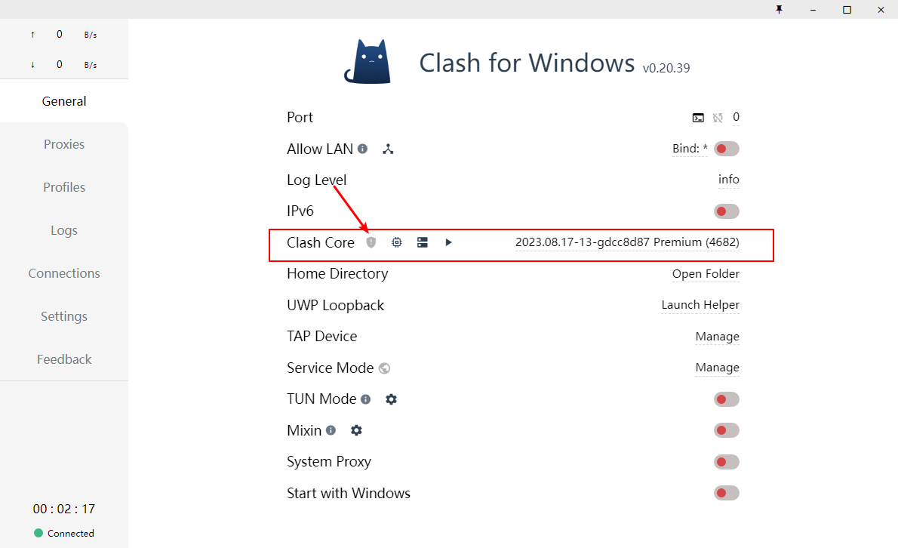

### 2. 确认 Core 状态

确认 Clash Core 已经处于开启状态。

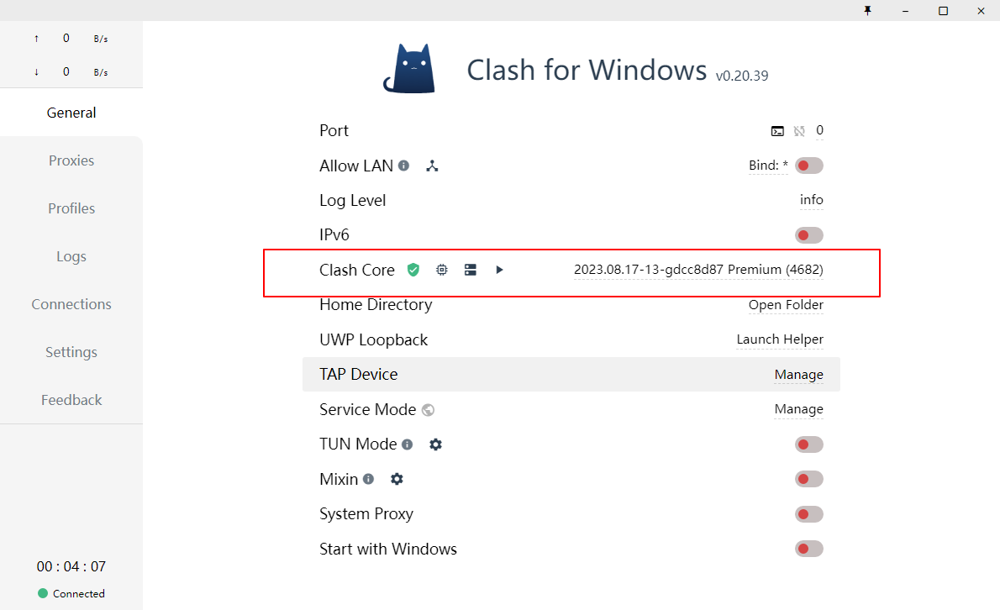

### 3. 开启 Service Mode

点击 Service Mode 入口，准备安装服务模式。

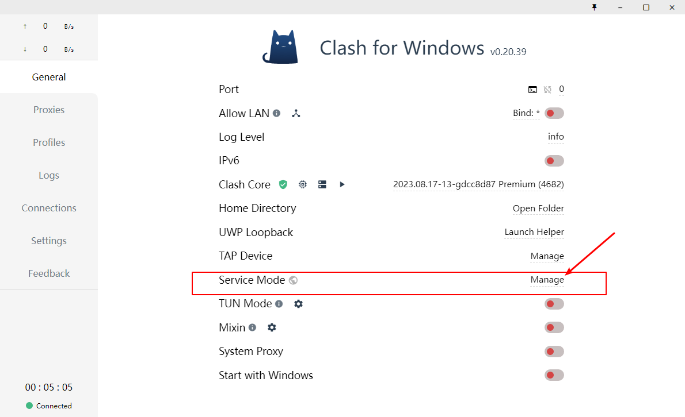

### 4. 安装服务模式

在弹窗中点击 Install，允许软件安装 Service Mode。

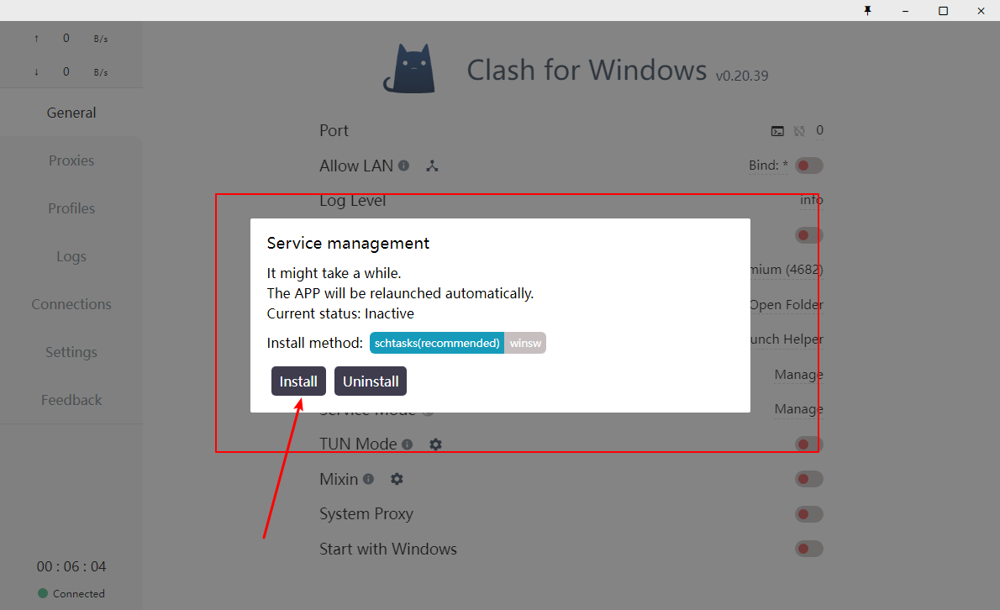

### 5. 确认 Service Mode

看到 Service Mode 安装成功后继续下一步。

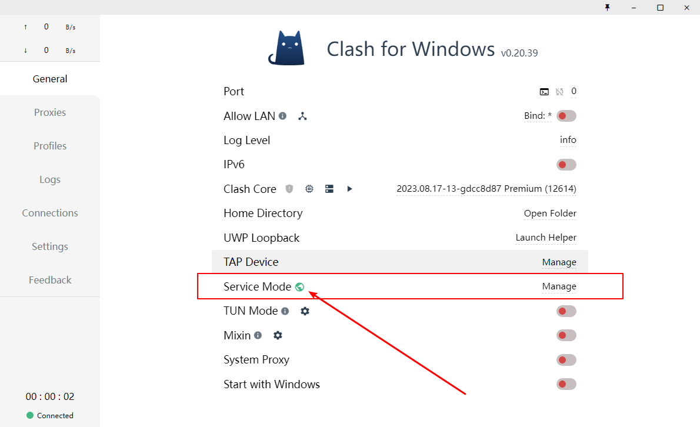

### 6. 进入 Profiles

点击 Profiles 或配置入口，打开订阅导入页面。

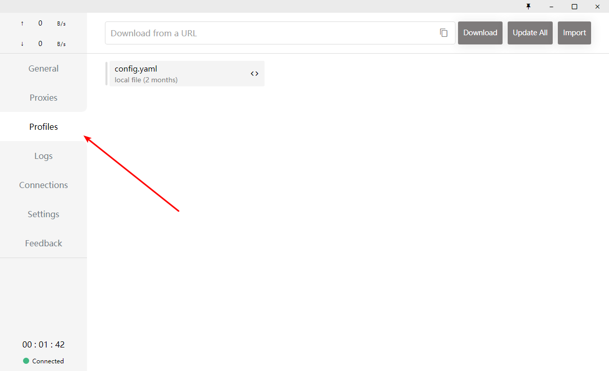

### 7. 粘贴订阅链接

把机场官网复制的订阅链接粘贴到输入框。

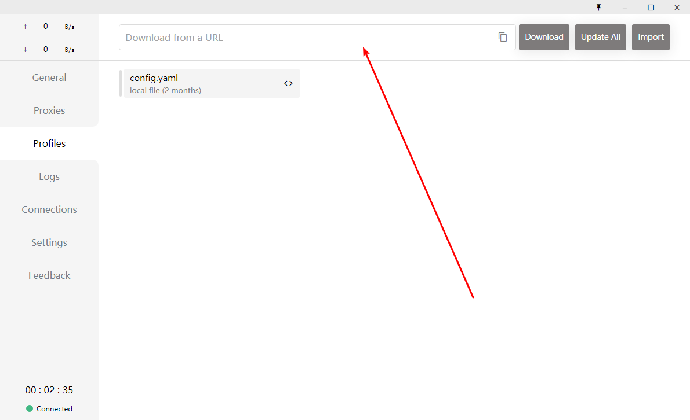

### 8. 下载订阅

点击 Download，将订阅配置下载到电脑。

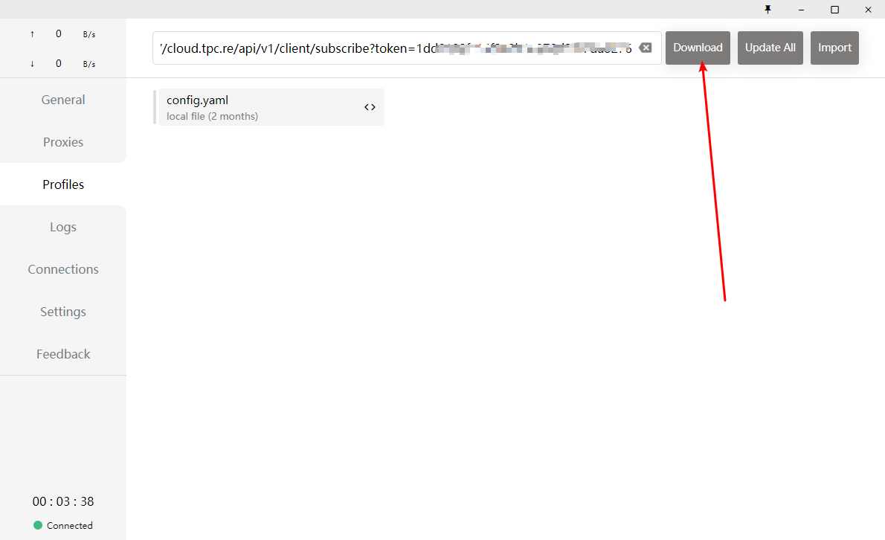

### 9. 确认下载成功

看到配置文件出现在列表中，说明订阅导入成功。

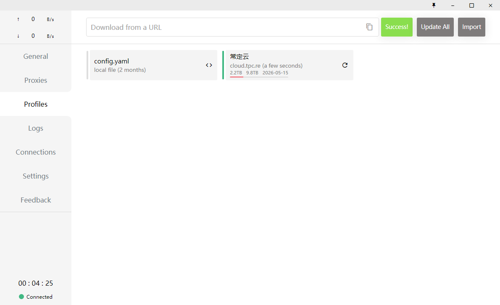

### 10. 选择节点

进入 Proxies，选择有延迟数值的节点；timeout 代表当前节点不可用。

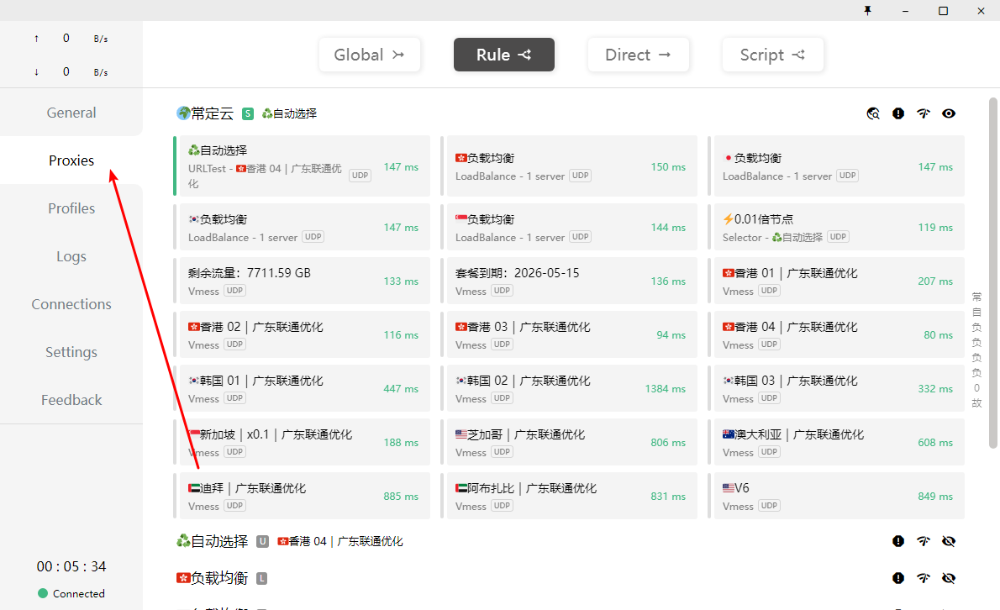

### 11. 开启系统代理

回到 General，打开系统代理相关开关后即可使用。

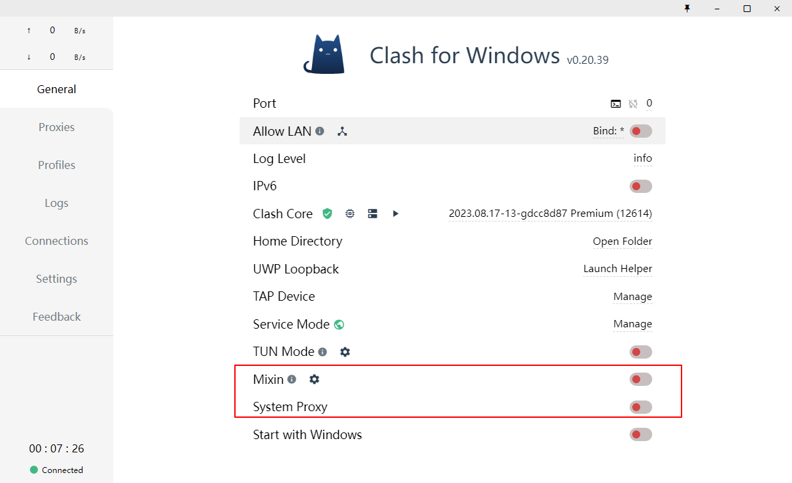

## 使用建议

- Clash for Windows 已长期停止维护，若新系统兼容性不好，可考虑 Clash Verge Rev、FlClash 或 Mihomo Party。

## 截图对应关系

本页截图按原始教程引用顺序整理，文件编号如下：

`60.png`, `61.png`, `62.png`, `63.png`, `64.png`, `65.png`, `66.png`, `67.png`, `68.png`, `69.png`, `70.png`, `71.png`, `72.png`

