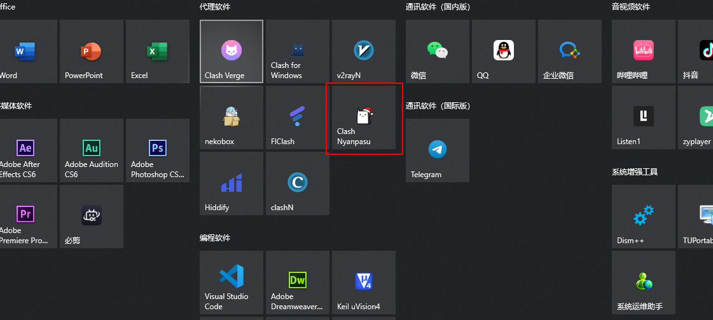
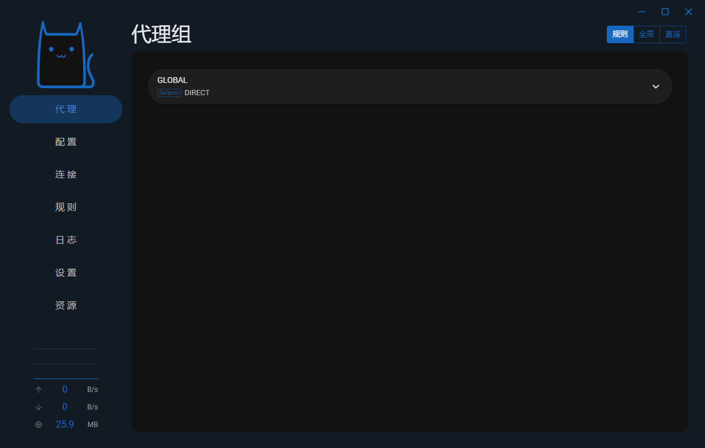
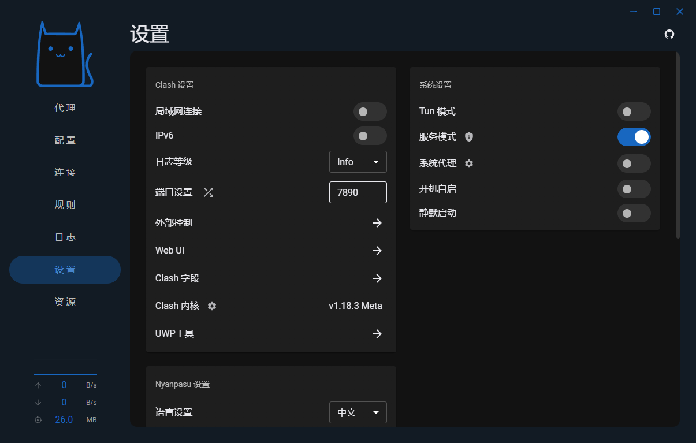
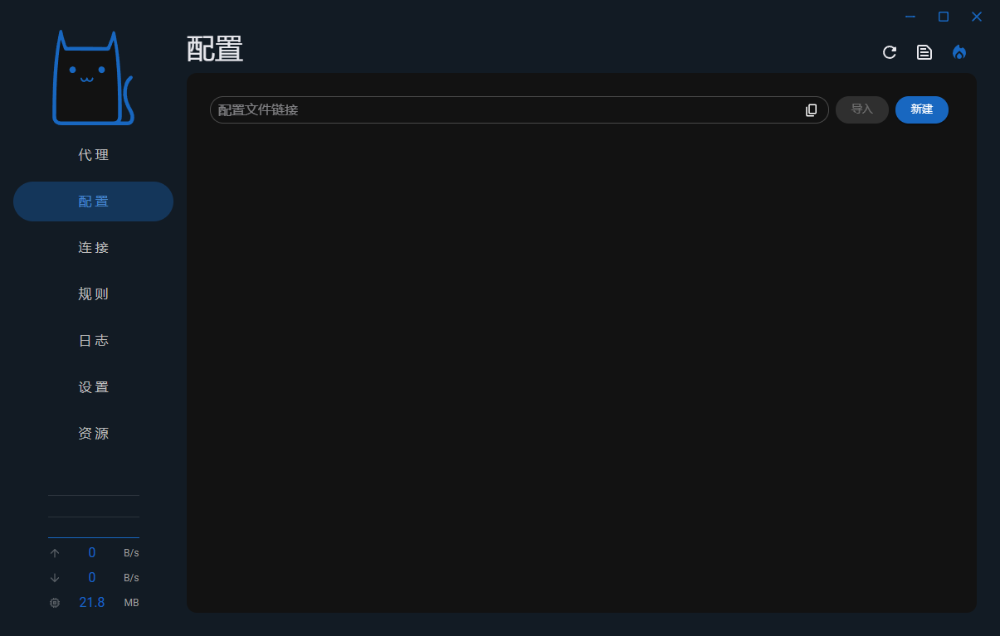
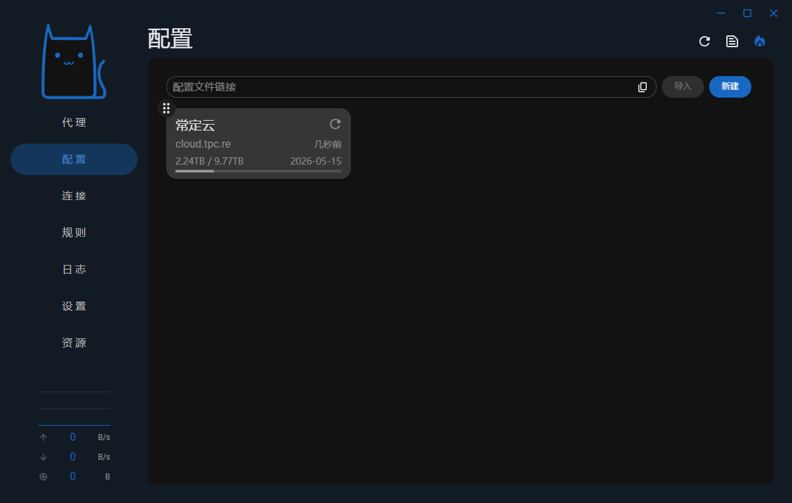
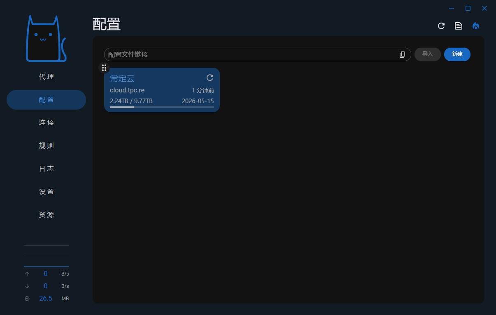
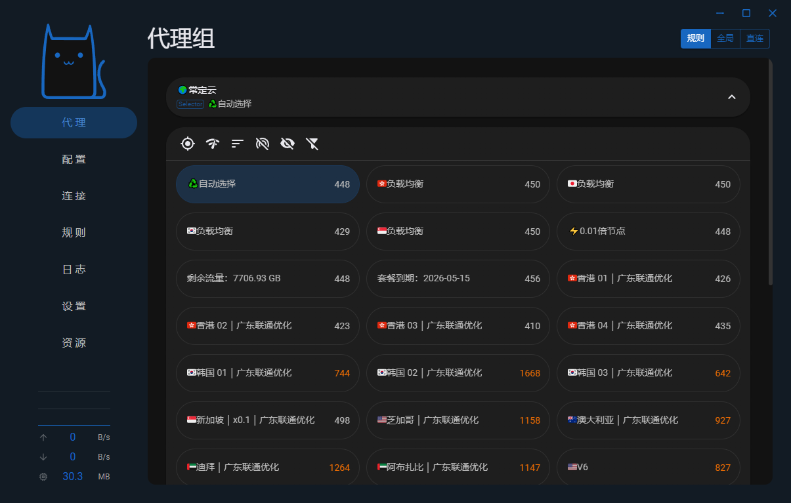

# Clash Nyanpasu 使用教程：订阅链接导入、节点测速与系统代理设置

适用平台：Windows

适用关键词：Clash Nyanpasu 教程、Nyanpasu 订阅导入、Windows Mihomo 客户端。

本教程用于帮助用户把服务商提供的订阅链接导入 Clash Nyanpasu，完成节点测速，并选择可用节点。请在当地法律法规和服务条款允许的范围内使用网络代理工具。

## 教程导航

- [返回首页](../../README.md)
- [查看软件下载地址](../../docs/proxy-client-downloads.md)
- [订阅无效排查](../../docs/troubleshooting/invalid-subscription.md)

## 软件截图

### 软件图标

下图是 Clash Nyanpasu 的软件图标，用于确认没有打开到其他同名或仿冒客户端。

### 主界面预览

下图是 Clash Nyanpasu 的主界面或初始界面，后续步骤会从这里开始操作。

## 操作步骤

### 1. 打开服务模式

进入设置，开启服务模式。

### 2. 导入订阅

打开配置页面，在配置文件链接处粘贴订阅链接并点击导入。

### 3. 确认导入

看到导入成功提示或新配置文件后继续。

### 4. 设为活动订阅

点击刚导入的订阅，将其设置为活动配置。

### 5. 选择节点

返回代理页面，选择有延迟的节点使用。

## 使用建议

- 如果代理页没有延迟结果，先手动触发一次节点测速。

## 截图对应关系

本页截图按原始教程引用顺序整理，文件编号如下：

`80.png`, `81.png`, `82.png`, `83.png`, `84.png`, `85.png`, `86.png`

