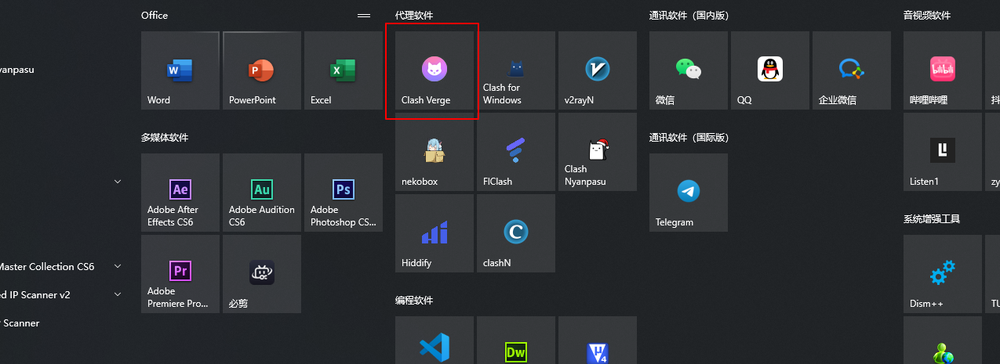

# Clash Verge 使用教程：订阅链接导入、节点测速与系统代理设置

适用平台：Windows

适用关键词：Clash Verge 教程、Clash Verge 订阅导入、Windows Clash Verge 配置。

本教程用于帮助用户把服务商提供的订阅链接导入 Clash Verge，完成节点测速，并选择可用节点。请在当地法律法规和服务条款允许的范围内使用网络代理工具。

## 教程导航

- [返回首页](../../README.md)
- [查看软件下载地址](../../docs/proxy-client-downloads.md)
- [订阅无效排查](../../docs/troubleshooting/invalid-subscription.md)

## 软件截图

### 软件图标

下图是 Clash Verge 的软件图标，用于确认没有打开到其他同名或仿冒客户端。

### 主界面预览

下图是 Clash Verge 的主界面或初始界面，后续步骤会从这里开始操作。

## 操作步骤

### 1. 启用服务模式

在设置中开启服务模式，保证系统代理能正常接管流量。

### 2. 导入订阅

在配置页的订阅文件链接处粘贴订阅链接，点击导入，并将新配置设为活动文件。

### 3. 确认导入成功

看到配置文件出现在列表中后，说明订阅已经保存。

### 4. 开启系统代理

回到设置页面开启系统代理。

### 5. 选择节点

进入代理页面，选择一个有延迟的节点使用。

## 使用建议

- 旧版 Clash Verge 已归档，优先使用仍在维护的 Clash Verge Rev。

## 截图对应关系

本页截图按原始教程引用顺序整理，文件编号如下：

`73.png`, `74.png`, `75.png`, `76.png`, `77.png`, `78.png`, `79.png`

