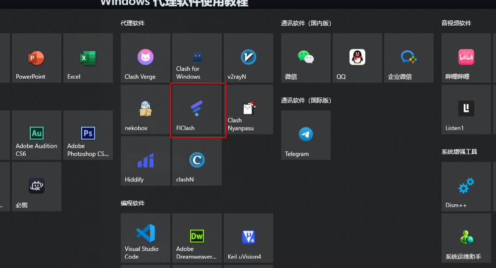
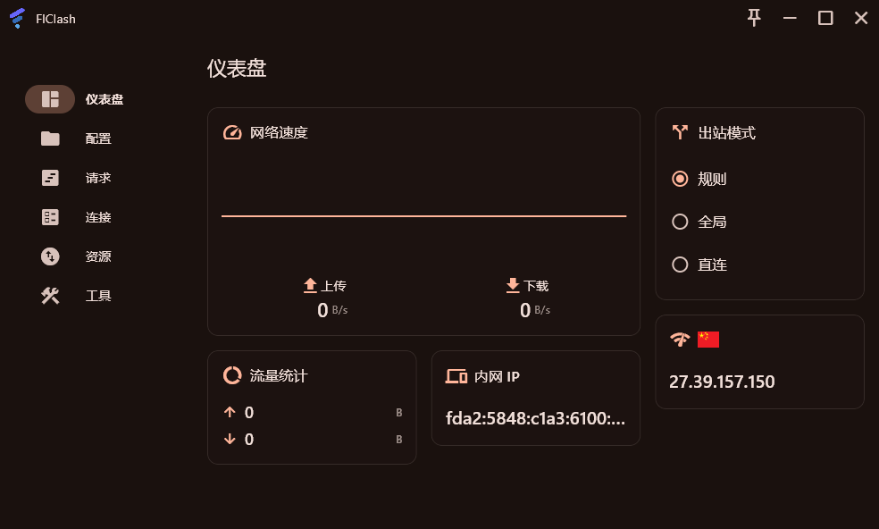
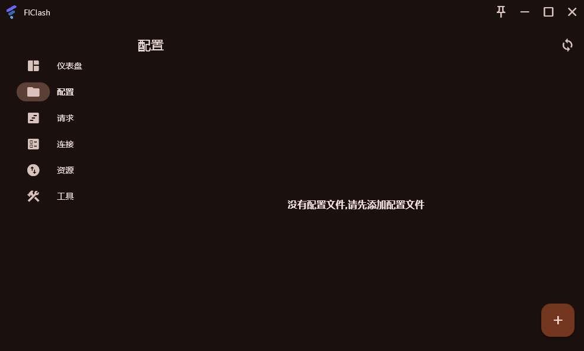
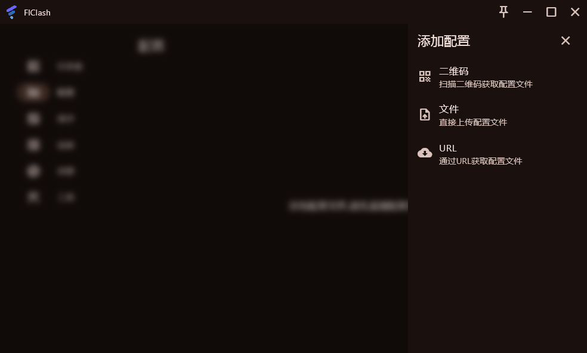
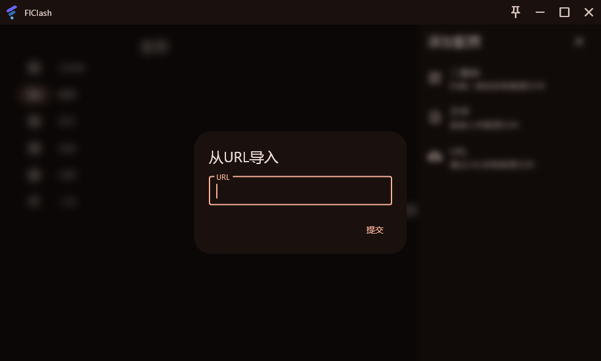
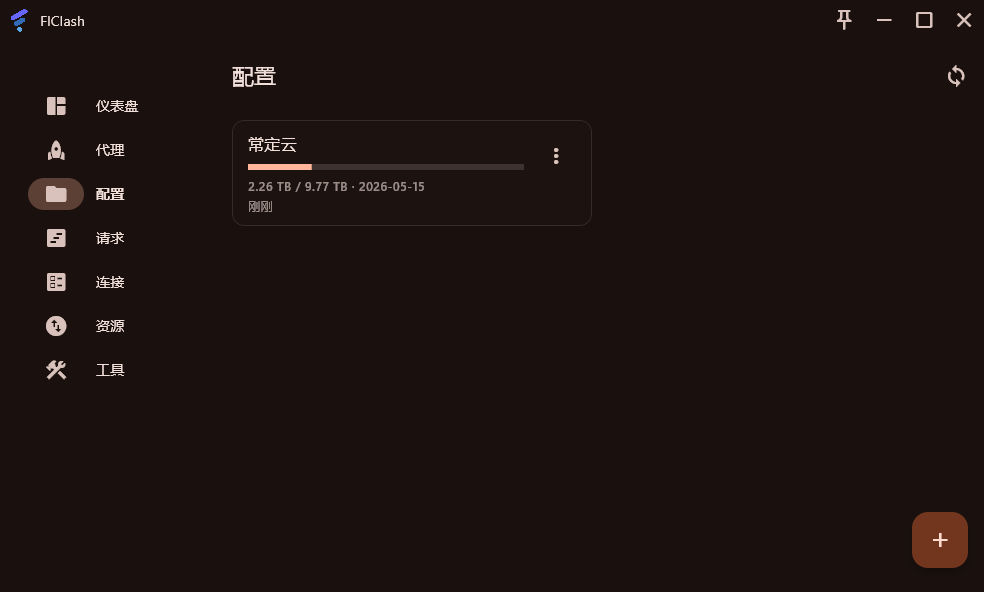

# FlClash for Windows 使用教程：订阅链接导入、节点测速与系统代理设置

适用平台：Windows

适用关键词：FlClash Windows 教程、FlClash 订阅导入、Windows FlClash 配置。

本教程用于帮助用户把服务商提供的订阅链接导入 FlClash for Windows，完成节点测速，并选择可用节点。请在当地法律法规和服务条款允许的范围内使用网络代理工具。

## 教程导航

- [返回首页](../../README.md)
- [查看软件下载地址](../../docs/proxy-client-downloads.md)
- [订阅无效排查](../../docs/troubleshooting/invalid-subscription.md)

## 软件截图

### 软件图标

下图是 FlClash for Windows 的软件图标，用于确认没有打开到其他同名或仿冒客户端。

### 主界面预览

下图是 FlClash for Windows 的主界面或初始界面，后续步骤会从这里开始操作。

## 操作步骤

### 1. 进入配置

点击配置页面，再点击右下角加号。

### 2. 选择 URL 导入

在添加配置中选择 URL/通过 URL 获取配置文件。

### 3. 提交订阅

在 URL 输入框粘贴订阅链接，点击提交。

### 4. 确认下载成功

看到订阅配置出现在列表中。

### 5. 选择节点

进入代理页面，选择有延迟的节点。

### 6. 开启系统代理

返回仪表盘，点击右下角按钮开启连接。

## 使用建议

- FlClash 支持多平台，适合希望 Android 和 Windows 操作习惯接近的用户。

## 截图对应关系

本页截图按原始教程引用顺序整理，文件编号如下：

`109.png`, `110.png`, `111.png`, `112.png`, `113.png`, `114.png`, `115.png`, `116.png`

