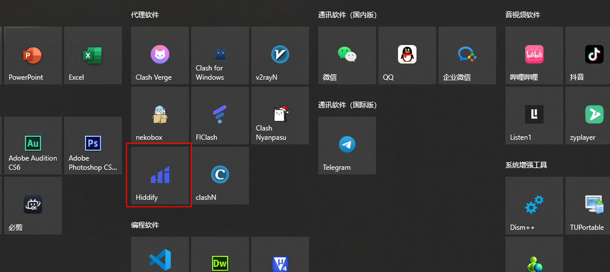
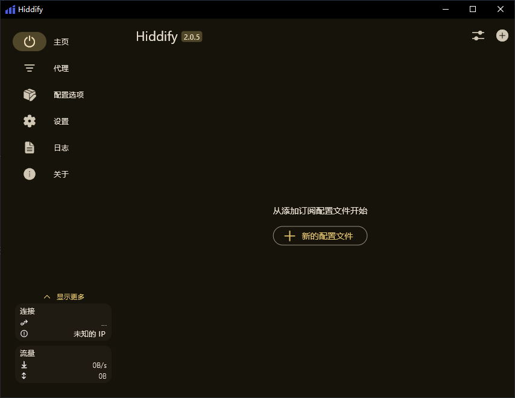
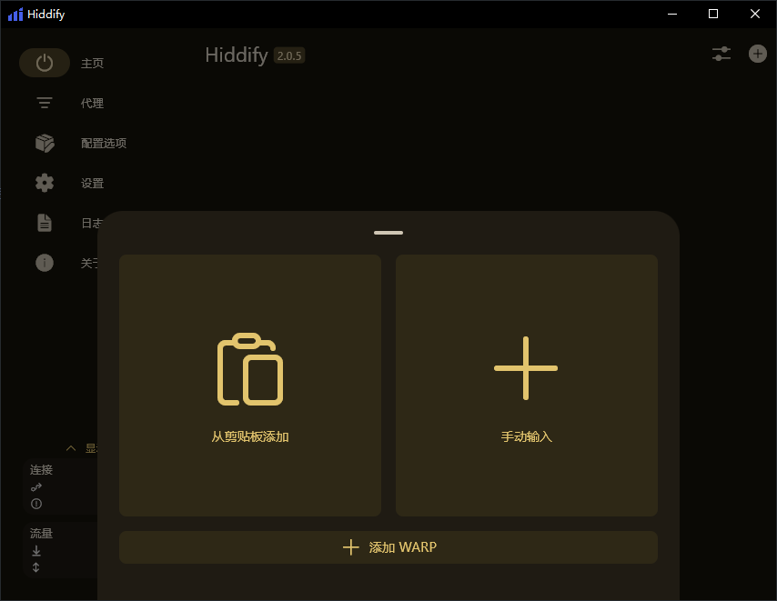
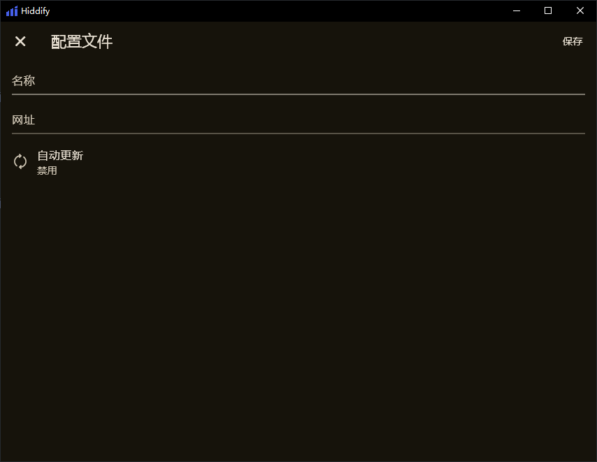
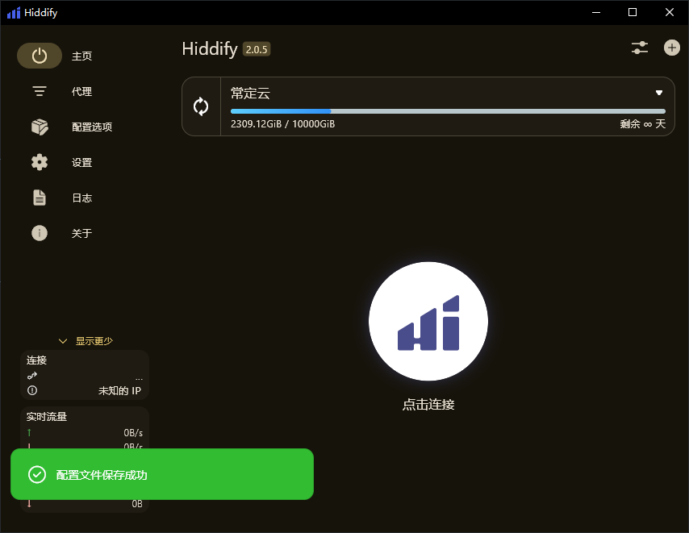
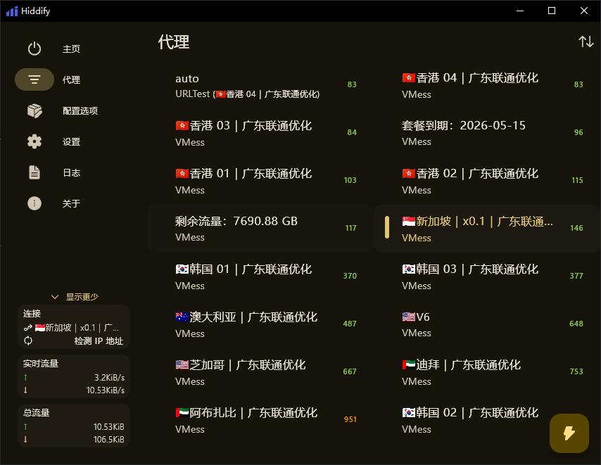

# Hiddify for Windows 使用教程：订阅链接导入、节点测速与系统代理设置

适用平台：Windows

适用关键词：Hiddify Windows 教程、Hiddify 订阅设置、Windows Hiddify 配置。

本教程用于帮助用户把服务商提供的订阅链接导入 Hiddify for Windows，完成节点测速，并选择可用节点。请在当地法律法规和服务条款允许的范围内使用网络代理工具。

## 教程导航

- [返回首页](../../README.md)
- [查看软件下载地址](../../docs/proxy-client-downloads.md)
- [订阅无效排查](../../docs/troubleshooting/invalid-subscription.md)

## 软件截图

### 软件图标

下图是 Hiddify for Windows 的软件图标，用于确认没有打开到其他同名或仿冒客户端。

### 主界面预览

下图是 Hiddify for Windows 的主界面或初始界面，后续步骤会从这里开始操作。

## 操作步骤

### 1. 新建配置

在主界面点击添加新的配置文件。

### 2. 选择手动输入

在添加方式中选择手动输入。

### 3. 填写订阅链接

在网址处粘贴订阅链接，名称填写备注，然后点击保存。

### 4. 确认保存

看到配置保存成功后返回主界面。

### 5. 选择可用节点

进入代理页，等待 Hiddify 自动测速，选择有延迟的节点。

## 使用建议

- Hiddify 自动化程度较高，适合不想手动维护太多规则的用户。

## 截图对应关系

本页截图按原始教程引用顺序整理，文件编号如下：

`103.png`, `104.png`, `104.png`, `105.png`, `106.png`, `107.png`, `108.png`

