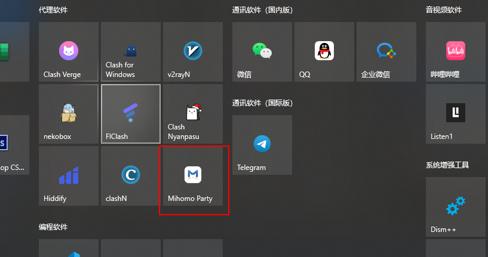
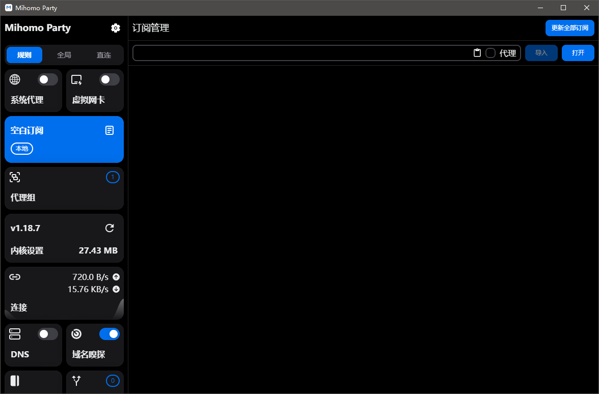
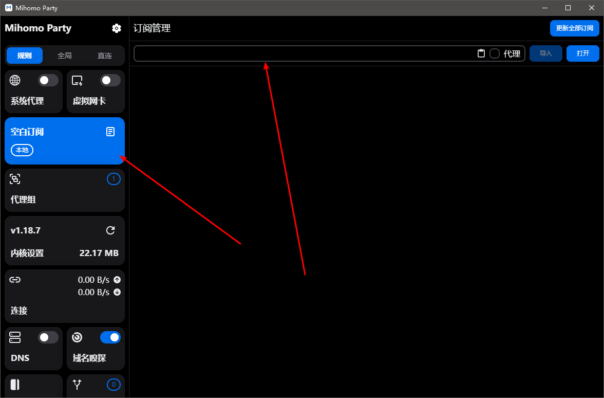
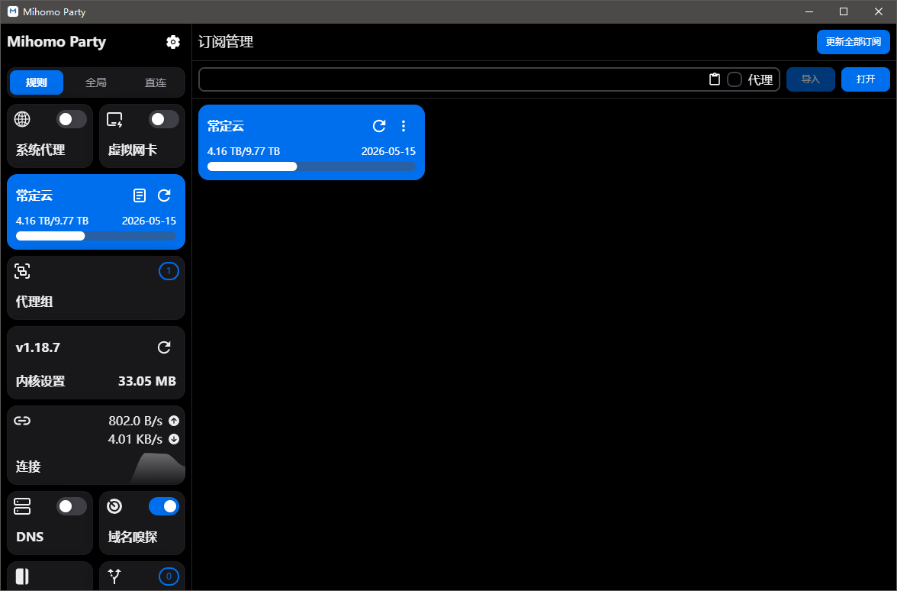
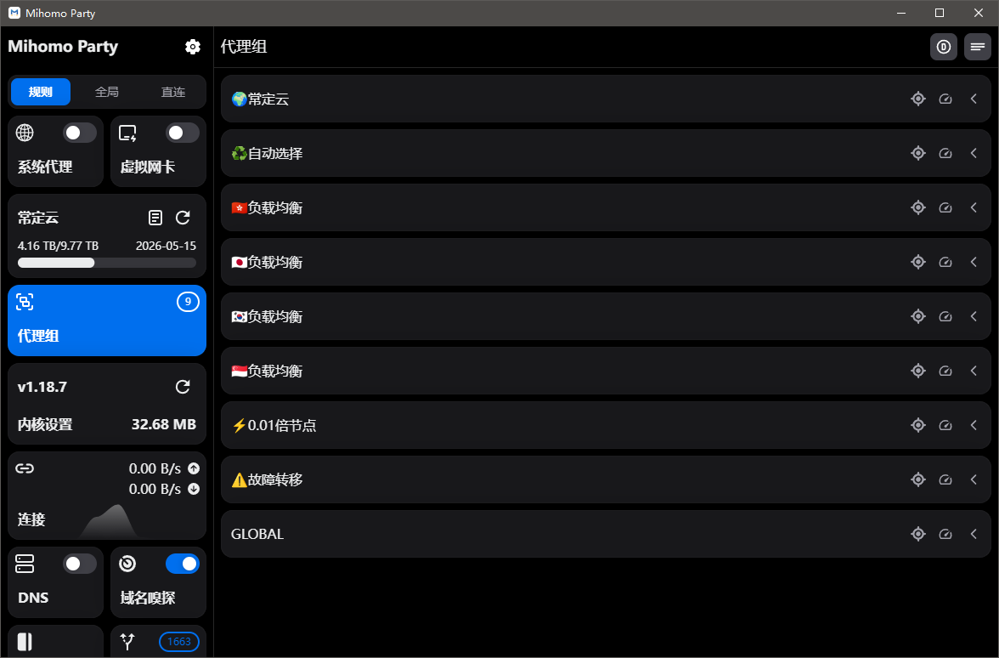
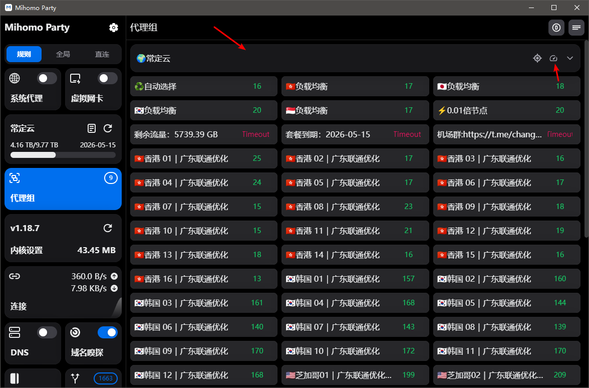
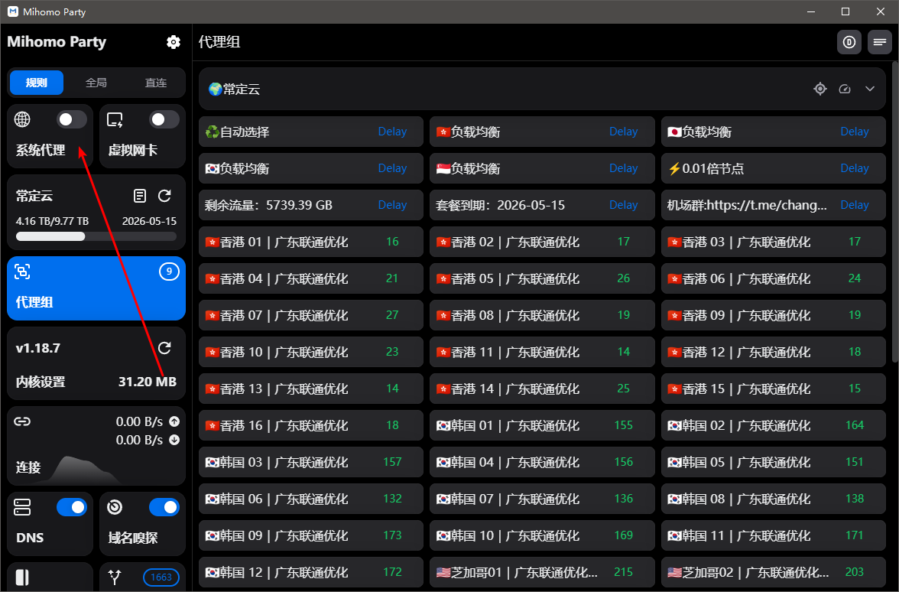

# Mihomo Party for Windows 使用教程：订阅链接导入、节点测速与系统代理设置

适用平台：Windows

适用关键词：Mihomo Party 教程、mihomo-party 订阅导入、Windows Mihomo 客户端。

本教程用于帮助用户把服务商提供的订阅链接导入 Mihomo Party for Windows，完成节点测速，并选择可用节点。请在当地法律法规和服务条款允许的范围内使用网络代理工具。

## 教程导航

- [返回首页](../../README.md)
- [查看软件下载地址](../../docs/proxy-client-downloads.md)
- [订阅无效排查](../../docs/troubleshooting/invalid-subscription.md)

## 软件截图

### 软件图标

下图是 Mihomo Party for Windows 的软件图标，用于确认没有打开到其他同名或仿冒客户端。

### 主界面预览

下图是 Mihomo Party for Windows 的主界面或初始界面，后续步骤会从这里开始操作。

## 操作步骤

### 1. 导入订阅

点击空白订阅，在订阅地址输入栏粘贴订阅链接，点击导入。

### 2. 确认导入

看到订阅出现在列表中，说明配置已经添加。

### 3. 进入代理组

点击代理组位置，查看节点和策略组。

### 4. 测速选节点

展开节点信息，等待自动测速；如没有延迟，点击测速图标手动测试。

### 5. 开启系统代理

点击开启系统代理，即可开始使用。

## 使用建议

- Mihomo Party 适合偏新内核的 Windows 代理客户端使用场景。

## 截图对应关系

本页截图按原始教程引用顺序整理，文件编号如下：

`117.png`, `118.png`, `119.png`, `120.png`, `121.png`, `122.png`, `123.png`

