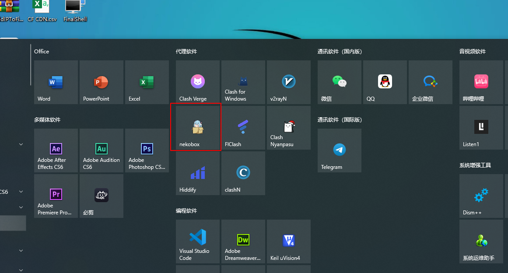
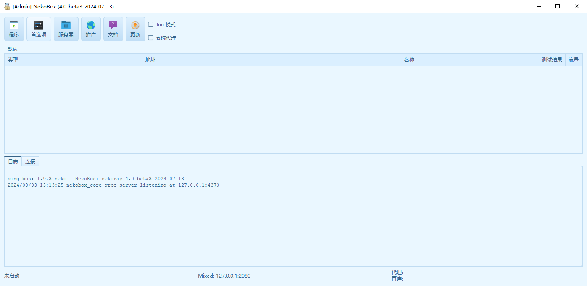
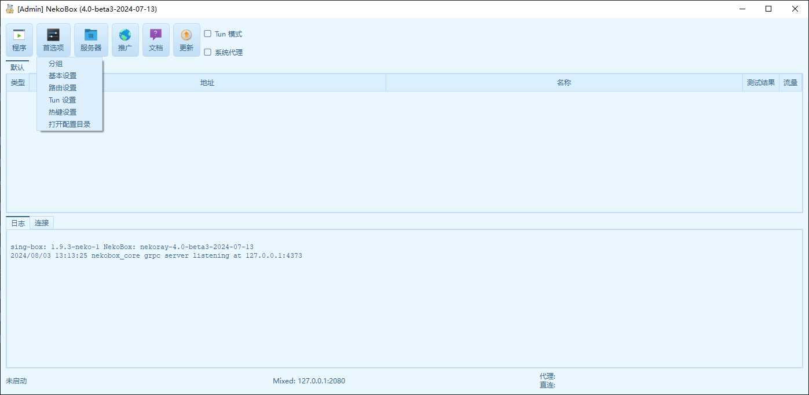
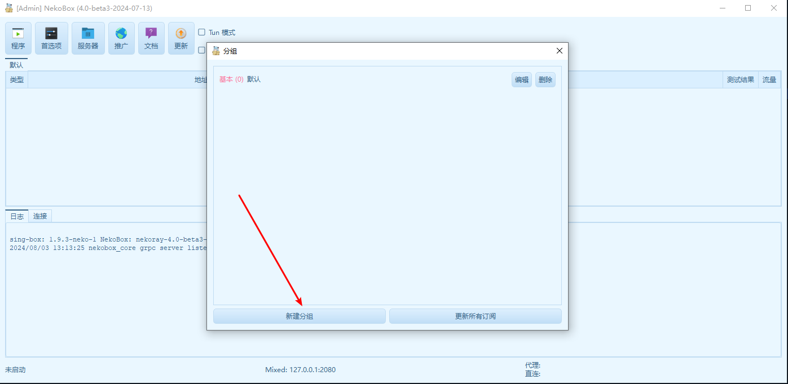
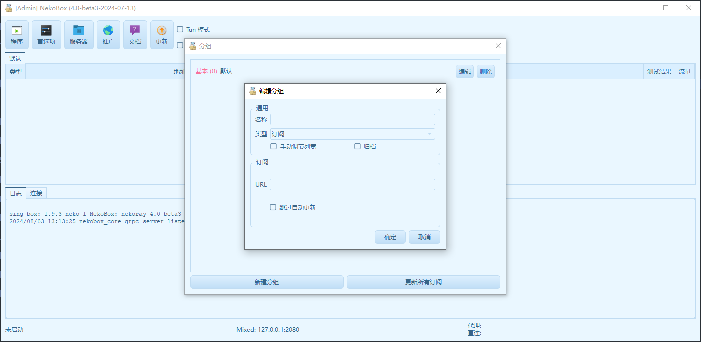
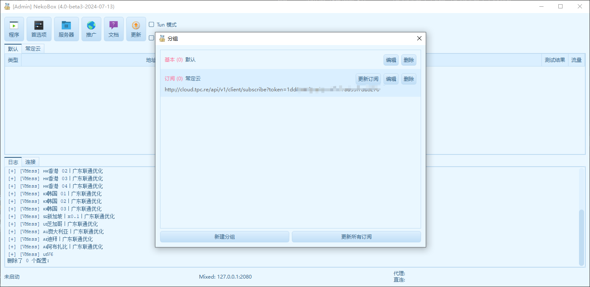
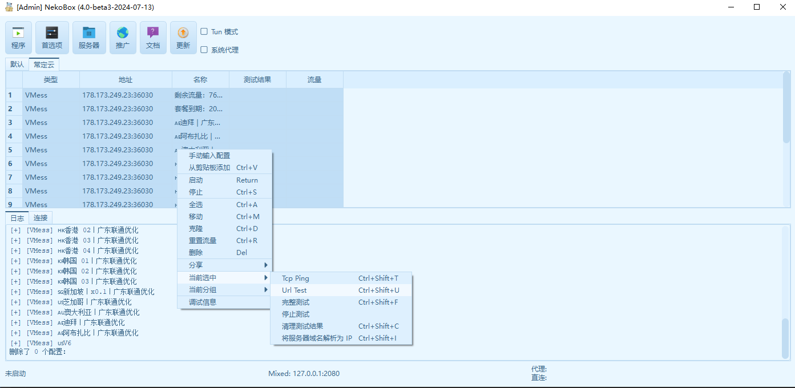

# NekoBox for Windows 使用教程：订阅链接导入、节点测速与系统代理设置

适用平台：Windows

适用关键词：NekoBox Windows 教程、NekoRay 订阅设置、Windows NekoBox 配置。

本教程用于帮助用户把服务商提供的订阅链接导入 NekoBox for Windows，完成节点测速，并选择可用节点。请在当地法律法规和服务条款允许的范围内使用网络代理工具。

## 教程导航

- [返回首页](../../README.md)
- [查看软件下载地址](../../docs/proxy-client-downloads.md)
- [订阅无效排查](../../docs/troubleshooting/invalid-subscription.md)

## 软件截图

### 软件图标

下图是 NekoBox for Windows 的软件图标，用于确认没有打开到其他同名或仿冒客户端。

### 主界面预览

下图是 NekoBox for Windows 的主界面或初始界面，后续步骤会从这里开始操作。

## 操作步骤

### 1. 打开分组

点击首选项，选择分组。

### 2. 新建分组

在分组窗口点击新建分组。

### 3. 填写订阅

类型选择订阅，名称填写备注，勾选手动调节列宽，在 URL 粘贴订阅链接。

### 4. 更新订阅

保存后点击更新订阅。

### 5. 确认节点

看到节点出现在列表中，说明订阅更新成功。

### 6. 测速并开启代理

选择订阅分组，右键测试真连接延迟，选择可用节点并开启系统代理。

## 使用建议

- NekoBox/NekoRay 的菜单较多，订阅链接一定要填在分组 URL 中。

## 截图对应关系

本页截图按原始教程引用顺序整理，文件编号如下：

`87.png`, `88.png`, `89.png`, `90.png`, `91.png`, `92.png`, `93.png`, `94.png`

