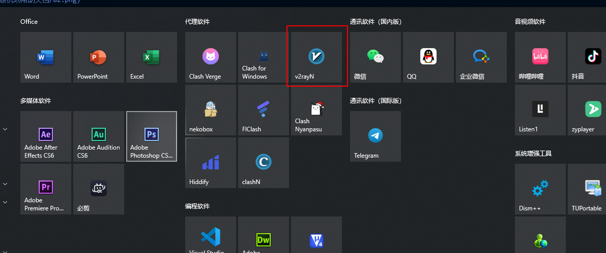

# V2rayN 使用教程：订阅链接导入、节点测速与系统代理设置

适用平台：Windows

适用关键词：V2rayN 教程、V2rayN 订阅分组、Windows V2rayN 配置。

本教程用于帮助用户把服务商提供的订阅链接导入 V2rayN，完成节点测速，并选择可用节点。请在当地法律法规和服务条款允许的范围内使用网络代理工具。

## 教程导航

- [返回首页](../../README.md)
- [查看软件下载地址](../../docs/proxy-client-downloads.md)
- [订阅无效排查](../../docs/troubleshooting/invalid-subscription.md)

## 软件截图

### 软件图标

下图是 V2rayN 的软件图标，用于确认没有打开到其他同名或仿冒客户端。

### 主界面预览

下图是 V2rayN 的主界面或初始界面，后续步骤会从这里开始操作。

## 操作步骤

### 1. 打开订阅分组设置

点击订阅分组，选择订阅分组设置。

### 2. 添加分组

在订阅分组设置中点击添加。

### 3. 填写订阅地址

别名填写备注，可选地址/url 粘贴订阅链接，点击确定保存。

### 4. 更新订阅

选择更新当前订阅；如果订阅地址被网络阻断，再尝试通过代理更新。

### 5. 确认更新结果

节点列表出现后说明订阅已下载。

### 6. 测试真连接

Ctrl+A 全选节点，右键选择测试服务器真连接延迟，使用有延迟的节点。

## 使用建议

- V2rayN 的“真连接延迟”比普通 ping 更接近实际可用性。

## 截图对应关系

本页截图按原始教程引用顺序整理，文件编号如下：

`95.png`, `96.png`, `97.png`, `98.png`, `99.png`, `100.png`, `101.png`, `102.png`

